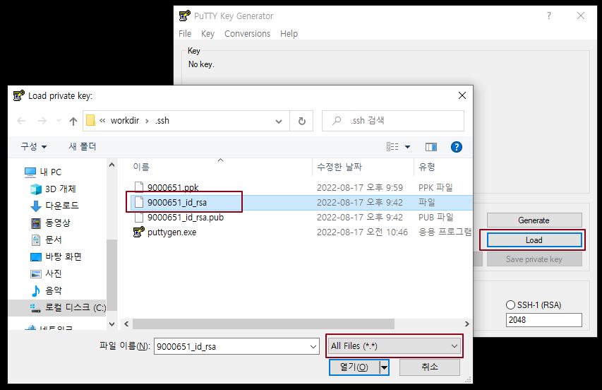
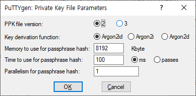
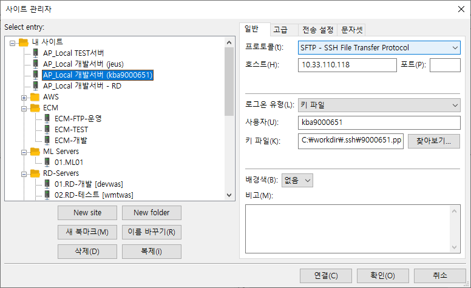
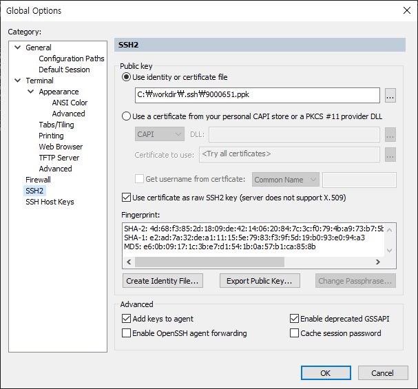
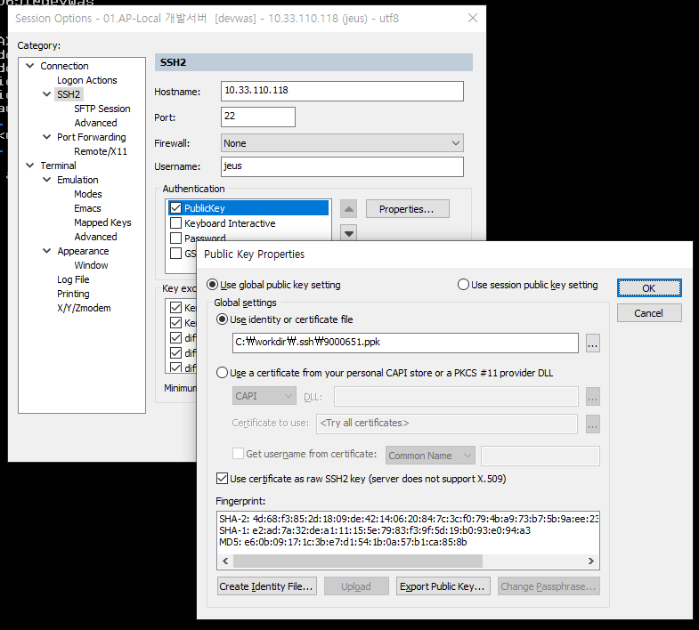

개발 도구 인증서 적용 가이드
===================
  
  >  `@author Tansan Man(tansan5150)`    
  >  `@up to date 2022.10.17` 
    
<br>

[](https://creativecommons.org/licenses/by/2.0/kr/)  
본 웹사이트는 크리에이티브 커먼즈 저작자표시 2.0 대한민국 라이선스에 따라 이용할 수 있습니다.  

<br>

### 1. 인증서 생성 
<br>

매번 개발서버의 비밀번호가 바뀔 때 마다 서버접근제어에 들어가 비번을 복사하고 Editor, FTP, 터미널(CRT) 클라이언트에 비번을 바꿔서 적용하는 것은 여간 귀찮은 일이 아니다. 비번이 바뀌던 말던 내가 쓰는 개발 도구에 영향을 미치지 않고 인증서를 사용하여 편리하게 개발 업무에 집중해 보자. 
  > 심지어 ID/Password 방식 보다 인증서 방식이 보안 레벨이 높다.  
  > 그래서 클라우드나 보안 레벨이 높은 곳에서는 ID/Password 방식을 불허 하기도 한다.  

지금 만드는 키 방식을 PKI 방식이라고 한다.  이 PKI 방식의 키는 개인(Private) 키와 공개(Public) 키 쌍으로 이루어진다. 쉽게 생각하면 개인키는 열쇠고 공개키는 자물쇠다. 

```

 - 공개 키: 자물쇠는 열고자 하는 여러 곳(서버)에 설치, 어쩌면 다른 사람도 볼 수도 있는 곳에 공개 되어 있다. 
 - 개인 키: 열쇠는 함부로 공개해서는 안 되는 것이며 나만(PC) 가지고 있어야 한다. 

```

  1. 관리망 PC에서 `실행` > `cmd` 
  2.  `cd c:/workdir/.ssh`   

    > 편의상 앞으로 `c:/workdir` 에 `.ssh` 디렉토리를 둔다고 가정 한다.  
    > 해당 폴더는 윈도우 탐색기에서 미리 만들어 둔다.  
    > 실제 위치나 디렉토리명은 아무데나 해도 상관없다. 

  3. `ssh-keygen -t rsa -f 9000651_id_rsa`  

    > 기본 값으로 전부 `Enter` 만 입력 하여 끝까지 진행 한다.  
    > linux 명령어 처럼 보이지만(실제 똑같다) 윈도우 명령이다.  
    > `-f 9000651_id_rsa` 는 저장 될 파일명 이며 아무 이름으로 해도 된다.  

  `9000651_id_rsa` , `9000651_id_rsa.pub` 두 개의 파일이 생긴다. .pub 가 공개 키고 다른 하나가 개인 키다.  
  지금 만들어진 `9000651_id_rsa` 란 이름의 개인키는 pem 형식의 개인키다. 하지만 이 형식을 Windows 에서는 사용 할 수 없다. 따라서 윈도우에서 사용 가능 한 ppk 형식의 개인 키로 바꿔 줘야 한다.

  4. pem -> ppk  변환 도구 다운로드  
    [puttygen.exe](./puttygen.zip) 

  5. `Load` > `All Files(*.*)` > `9000651_id_rsa` 선택   

     

  6. 메뉴 `Key` > `Parameters for saving key files` > `PPK File Version` : `2`  > `OK`

     

  7.  `Save private key` > `예(Y)` > `파일이름: 9000651` > `저장`  

    > .ppk 형식의 파일이 생긴다. 이 개인키가 실제 열쇠 역할을 할 것이다.  
    > 파일이름은 아무 것이나 넣어도 된다. 예제는 귀찮아서 내 사번을 넣었을 뿐이다.


<br><br>

### 2. 개발 서버 적용   
<br>

이제 본격적으로 자물쇠(공개 키) 달기를 해보자 개발서버에 자물쇠를 달고 관리망 PC에 있는 열쇠(개인 키)를 사용해 CRT, FTP, Editor 를 퇴사 전 까지 비번 변경 없이 편리하게 사용 해 보자. 

  1. 개발서버에 공개키(자물쇠) 업로드 
    *  FTP Client(FileZilla)로 사용자 계정의 home의 .ssh 에 9000651_id_rsa.pub 업로드
    * .ssh 없을 시 우측클릭 > `디렉터리 만들기(C)`로 `.ssh` 생성
    * `.ssh` 폴더 > 우측클릭 >  `파일권한` > `숫자값: 700`  
      > 주의: .ssh 디렉토리 권한에 group, others 접근 Permission 이 있는 경우 키 인증이 작동하지 않는다.
    * 1장에서 만든 공개키 .pub 파일을 업로드 한다.  

  2. 공개 키 설치 하기  
  Secure CRT로 개발서버 접속
  ```bash
  cd ~/.ssh
  cat  ./9000651_id_rsa.pub >> ./authorized_keys
  chmod 600 ./authorized_keys
  rm   ./9000651_id_rsa.pub
  ``` 
  .pub 나 authorized_keys는 사실 plain text 파일이라 업로드 없이 vi로 열어 PC에서 복붙 해도 상관 없다. 다만 .pub 파일은 매우 긴 한 줄로 되어 있어 붙여 넣기 할 때 줄이 나뉘어 붙여넣기 되는 경우가 있고 그런 경우 키가 동작하지 않는다. 이를 미연에 방지하기 위해 upload 후 cat 방식을 권장 한다.   
  > 주의: 사용자의 home 디렉토리 권한에 group, others 쓰기 Permission 이 있는 경우 키 인증이 작동하지 않는다.  
  > 조치: 개발서버 접속 후 chmod 755 ~ 

<br><br>

### 3. 개발 도구에 적용
<br>

#### 3.1 Filezilla
  * 사이트 관리자 `CTRL+S` > 개발서버 선택 
  *  `로그온 유형: 키파일` > `찾아보기` 버튼으로 ppk 파일 선택 > `확인` 또는 `연결`
    

#### 3.2 Secure CRT 
  * 메뉴 `Options` > `Global Options...`
  * `Public Key` > `Use indentify or certificate file` 에 ppk 파일을 선택 > `OK`
     
  * Session Manager `ALT+M` > 개발서버 우측클릭 > `Properties`
  * `Connection` > `SSH2` > `Authentication` 체크 > 우측 화살 표 클릭 하여 최상단으로 이동
  * `PublicKey` 선택 > `Properties...` 버튼 클릭 > `Use global public key settings` 선택 > `OK` 
     
  * `PublicKey` 외 다른 항목 체크박스 선택 해제 > `OK`


#### 3.3 Sublime Text


  1. SFTP 직접 연결 및 편집(UltraEditor 방식)  
  > `CTRL+ALT+P `> `SFTP: Edit Server...` > devwas 선택

  2. 지정 폴더 저장 시 업로드 방식(Stateless)    
  > 해당 폴더의 sftp-config.json 을 연다. 

  3. 다음 내용을 편집 후 저장 (공통)
    * "password" 항목을 주석 처리
    * "ssh_key_file" 항목을 활성화 
     


  <br><br>

### 4. 서버 접속을 더 쉽게   
<br>

PC에서 개발서버로 인증서로 접속 했듯이 특정 서버에서 다른 서버도 인증서를 이용해 편리하게 접속 할 수 있다. 예를 들면 PC에서 직접 접속이 안되는 testwas, wmtwas 같은 경우 개발서버로 들어가 ssh 나 sftp 명령어를 통해서 접속 할 수 있다.  
관리망에서 직접 접속되는 개발서버의 본인 계정으로 로그인 후 한 단어 명령어로 대부분의 개발, 테스트 서버등에 id/password 없이 편리하게 접속 해 보자.  

편의를 위해 `devwas > wmtwas` 접속을 예제로 진행 한다. 

  1.  개발서버에서 인증서 생성  
    ssh-keygen 명령어 질문 시 계속 `Enter`를 눌러 기본 값으로 진행한다.  
    -f 옵션 뒤는 임으로 이름을 줘도 되고 생략해도 된다. 생략 시 id_rsa 란 이름이 default로 생긴다.
  ```bash  
  cd ~
  ssh-keygen -t rsa -f devwas_id_rsa
  ls -la .ssh   
  cat .ssh/devwas_id_rsa.pub
  ```

  2. 대상 서버 접속  
  개발서버에서 로그인 하고자 하는 서버에 ssh 명령어로 접속 한다.  
  port 번호는 22 아니면 10022를 대부분 사용하나 미리 파악 필요.
  ```bash
  ssh jeus7@10.33.90.11 -p 10022 
  ```

  3. 대상 서버 공개 키 적용  
  대상 서버에 접속 하여 `1.  개발서버에서 인증서 생성` 에서 나온 cat 명령어의 결과를 복사한다.
  Secure CRT에서 복사하면 길지만 딱 1줄로 복사 된다.
  ```bash
  vi .ssh/authorized_keys
  # 가장 아랫 줄에 복사한 내용을 붙여 널는다.
  # 이 때 중요한 것은 1줄로 복사 되는지 확인 해야 한다.
  # 저장 후 나온다.

  # 만약에 vi로 위 파일을 열 때 기존에 디렉토리가 없어서 새로 생긴 경우 아래 명령어로 퍼미션 설정을 해줘야 한다.
  chmod 700 .ssh
  chmod 600 .ssh/authorized_keys
  ```

    > [주의] 다음의 경우 key 파일이 동작 하지 않고 password를 물어 본다.  
    > 1. .ssh 디렉토리가 퍼미션이700 이 아닌 경우(group, others에 읽기 이상 권한이 있는 경우)  
    > 2. authorized_keys 파일 group, others에 쓰기 권한이 있는 경우  
    > 3. 사용자 계정 home 디렉토리 group/others 에 쓰기 권한이 있는 경우  

  4. 개발서버에서 대상서버 접속 확인
  성공적으로 적용이 완료되면 password 없이 접속이 된다.
  ```bash
  ssh jeus7@10.33.90.11 -p 10022 -i ~/.ssh/devwas_id_rsa
  ```

  5. 더 편한 접속을 위한 alias 생성  
  하지만 매번 ssh 또는 sftp 명령어를 입력하는 것은 너무 귀찮은 일이다. 따라서 간단한 단어로 alias를 만들어 편리하게 접속 해 보자.  
  개발서버에서 .bashrc를 편집 한다.  
  ```bash
  cd ~
  vi .bashrc
  ```
  다음과 같이 원하는 이름과 서버의 alias를 추가 한다.
  ```bash
  alias wmtwas='ssh jeus7@10.33.90.11 -p 10022 -i ~/.ssh/devwas_id_rsa'
  alias fwmtwas='sftp -oport=10022 -i ~/.ssh/devwas_id_rsa jeus7@10.33.90.11'
  ```

  6. 개발서버에서 접속 테스트  
  해당 서버의 shell 과 ftp 에 접속 되는 것을 확인 할 수 있다.  
  ```bash
  . .bash_profile  #변경된 .bashrc를 현 세션 적용을 위함, 다시 CRT 로그인 시 이 명령어 필요 없음
  wmtwas
  fwmtwas
  ```
