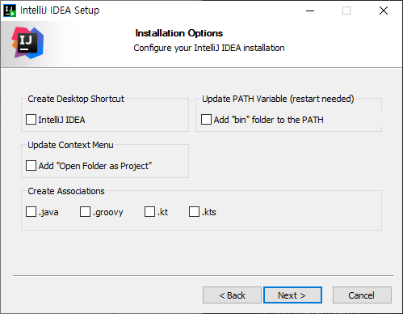
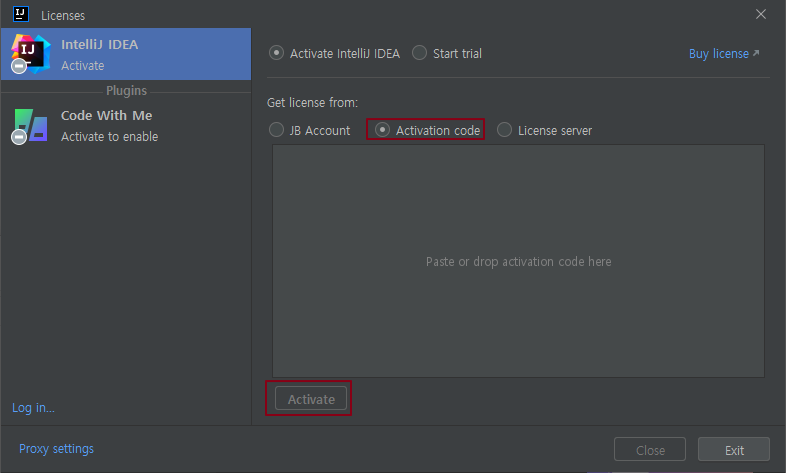
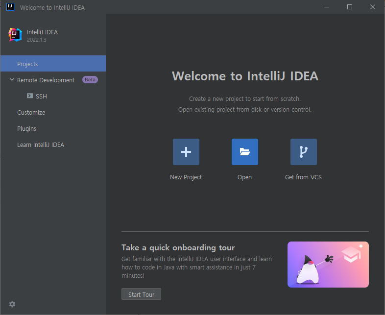
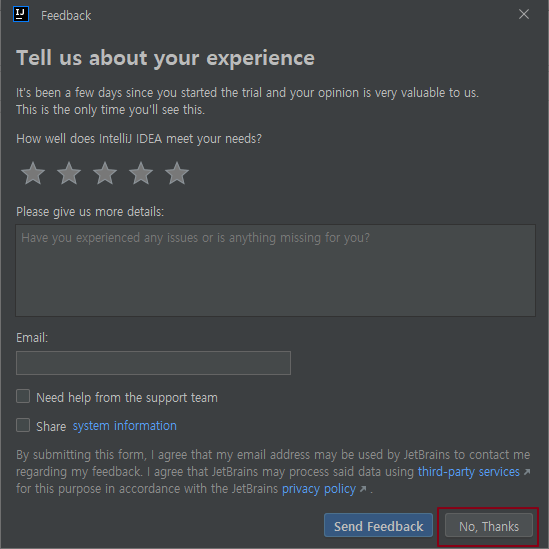
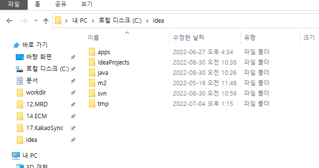
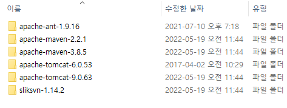
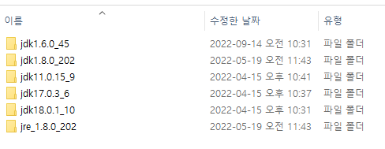
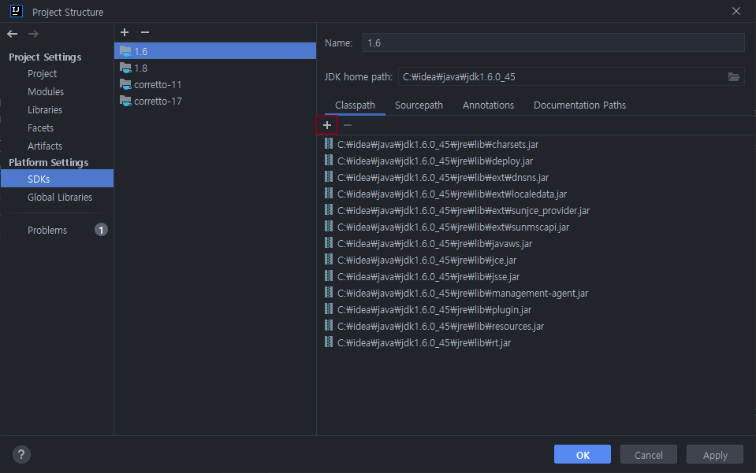
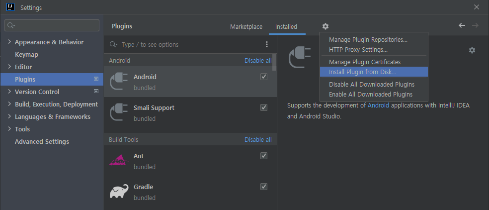

IntelliJ IDEA Ultimate 2022.1  Users' Guide
===================  
<br> <br> <br> <br> <br> <br> <br> <br>
  
  >   * `@author Tansan Man(tansan5150)`    
  >   * `@up to date 2022.09.06` 
    
<br>
<br>
[](https://creativecommons.org/licenses/by/2.0/kr/)  
본 웹사이트는 크리에이티브 커먼즈 저작자표시 2.0 대한민국 라이선스에 따라 이용할 수 있습니다.  

<br>
--------------------------------------

<br> 
### 목차
<br>
  > &nbsp; [1. 설치](#1)   
  > &nbsp; [2. 초기 설정](#2)   
  > &nbsp; [3. 기본 사용법](#3)  
  > &nbsp; [4. 프로젝트 구성 - AP](#4)  
  > &nbsp; [5. 이관 및 배포](#5)  


  <br> <br> <br> <br>
--------------------------------------
  <br>

### 1. 설치   
<br>

#### 1.1 idea 폴더 설치
설치본 디렉토리에는 `idea`, `install` 2가지 폴더 가 있다.  

  - `install`:  IntelliJ IDEA의 install 파일  
  -  `idea`: Eclipse의 Workspace에 해당하는 Project 폴더, 사용하는 여러 JDK, 연동 외부 프로그램(Tomcat, Maven, Ant, SVN 등) 및 Maven, GIT 저장소 등의 모음  

  이와 같이 Project 및 여러 부가적인 기능들을 한 곳에 모아서 관리하면 편리하며, 이러한 관리 방식을 추천 한다.  
  >  idea 폴더를 `C:\` 또는 `D:\` 또는 원하는 곳 에 위치 시킨다.  
  > 편의상 이후 `C:\idea\ideaProjects` 설치를 기준으로 설명 

<br> 

#### 1.2 프로그램 설치
  >  1. install 디렉토리의 `ideaIU-2022.1.4.exe` 를 실행해 설치 
  >  2. 설치위치는 `C:\Program Files` 같이 원하는 위치를 지정.  
  >  3. 기본 값으로 `다음` 버튼을 눌러 설치 진행을 추천 

   

  >  4. DATA SHARING > `Don't Send` 

  

<br> 

#### 1.3 License 등록
  > 설치 완료 후 실행 시 나오는 License Popup 에서 `Activation IntelliJ IDEA` 를 선택하여 제공된 라이선스 키를 붙여 넣음.  

   

  > 설치 이후 License 등록 시 : 메뉴 `Help` > `Register...` > `Active License` > `Activation Code` > `Active`  

  ``` 
  * 주의: 제공된 2022.1.4 버전 만 사용, 상위버전 사용 금지!
    - 상위 버전 사용 시 Subscription 이 끝나는 2023.7월 까지만 사용 가능, 추가 구독을 안 할 수 있음 
    - 2022.1.4 버전은 영구 라이선스 버전 

  * 관리망 PC 외 인터넷망, 개인 PC 등 사용 금지
  ``` 
<br>


<br><br>

### 2. 초기 설정   
<br>

#### 2.1 Project Root 생성
IntelliJ Idea는 Project Root 를 생성 후 그 안 에 여러 Module 을 생성할 수 있다. 이를 위해 먼저 Empty Project를 생성한다.  
예를 들면 Project Root는 AP가 되고, 이하 각 모듈이 Eclipse의 `/home/aplsrcs` 각 Project와 대응 됨.  

  > 1. License 등록 후 Welcome 화면: `New Project` > `Empty Project` > `Name` : 원하는 이름 , `Localtion` : `C:\idea\ideaProject` 를 지정 선택 > `Create`
  > 2. Project(workspace) 디렉토리는 `C:\idea\ideaProjects` 를 지정 (ideaProjects 대신 다른이름 해도 무방)  
  > 3. 설치 이후 생성 시: 우측 `Project 탐색기` 에 마우스 클릭 또는 `ALT`+`1` > `ALT`+`INSERT`  

   

IntelliJ Idea는 Eclipse 와는 달리 새 Project 가 생성되면 별도의 창 또는 탭에서 구분되어 표시 된다. 이는 어플리케이션의 개발 집중도를 높이기 위해서라고 하며, 따라서 독립적인 각 어플리케이션 별로 프로젝트 생성 하는 것을 추천 한다.  

  * Project: AP(전체), ECM, KAMS, ADAS 등  
  * Module: ADKAutoContractProject, ADKWebSalesBatchProject 등  

  아래와 같은 창이 나온다면 `No, Thanks`를 선택

  > 4. Tell us about your exprience > `No, thanks` 

   


AP의 경우 예를 들면 아래와 같은 모습이 된다. Eclipse 와 분류 기준이 다소 다르며, 실제 src가 있는 곳을 모듈이라고 하여 배포 및 설정의 기준이 된다.  

  - 최상단 AXA는 Project를 의미(Empty Project로 생성)  
  - Eclipse 의 각 Project 에 해당하는 묶음은 그냥 폴더  
  - Eclipse 의 Sub Project에 해당 하는 실제 src 가 있는 곳은 Module 이라고 한다.  

   
 


<br>

#### 2.2 외부 프로그램 설치 
`C:\idea` 내 각 디렉토리에서 아래와 같은 작업을 수행 한다. 

   

  > 1. apps : 모든 파일을 현재 디렉토리에 압축 해제 > 각 각의 폴더명으로 생성  
    
  >   - maven : 2 버전은 AP 사용(JDK1.5), 3 버전은 서브시스템 또는 차세대 용(JDK1.6 이상)  
  >   - tomcat : 6 버전 jdk 1.5 구동, 9 버전 jdk 1.7 이상 구동  
  >
  > 2. java: 모든 파일을 현재 디렉토리에 압축 해제 > 각 각의 폴더명으로 생성  
   
  >    - 모든 jdk 는 64 bit  
  >    - 1.6: Oracle JDK, (AP에 사용 예정)  
  >    - 1.8: Oracle JDK, 무료 사용가능한 마지막 버전  
  >    - 11: Amazon Corretto (무료 엔터프라이즈용 JDK)   
  >    - 17: Amazon Corretto (무료 엔터프라이즈용 JDK)  
  >
  > 3.  압축 해제 후 zip 파일들은 삭제 

  ```
    IntellJ Idea 2022 버전은 JDK 1.5를 지원하지 않아서 빌드와 실행 자체가 불가능 하다. 
    하지만 AP환경의 경우 어차피 서버 기반의 컴파일이므로 IDE에서는 문법 체크 정도만 하면 된다.
    따라서 AP에서 사용하기 위해서는 Project/모듈 설정(F4)에서 JDK 1.6 설정 뒤 Language Level을 1.5로 설정 후 사용 한다.
    그리고 내장된 ssh 플러그인을 이용 소스를 개발서버로 보낸 후 원격 컴파일 되게 할 수 있다.

  ```

<br>

#### 2.3 저장소 폴더 
  다음과 같은 저장소 폴더가 있으며, 이후 단계에서 다음 용도로 설정 예정
  > 1. m2 : 설치 후 Maven Repository 를 이곳으로 지정
  > 2. git : git 사용 시 저장소를 이곳으로 지정  
  > 3. ideaProjects : 이클립스의 workspace 와 동일  

<br>

#### 2.4 IntelliJ 추가 설정 
  > 1. Memory Setting: 메뉴 Help > "Change Memory Settings" > Maximum Heap Size: 2048
  > 2. JDK 등록: 우측 최상단 프로젝트 명 클릭 >`F4` >  `SDKs` > `+` > `Add JDK...` > C:\idea\java\jdk1.6.0_45 
  > 3. 마찬가지로 `+` 를 눌러 필요 시 1.8, 11, 17 버전 JDK도  등록  

   
  
<br>

#### 2.5 Plugin 설치

  > 1. `[SHIFT] 두 번` > `plugins` > `톱니 모양 아이콘` > `Install Plugin From Disk`
  > 2. plugins 폴더 내 zip 파일을 원하는 것 하나씩 선택

   
  > 3. 제공 Plugin 목록 

|Plugin 파일 | 기능 |
|----|------|
|CodeGlance_Pro-1.4.9-signed.zip | Sublime Text Editor 내 우측 코드 요약 화면과 같은 기능 |
|ko.222.168.zip  | 한국어 버전(공식제공) |
|one-dark-theme-5.6.0.zip | Color Scheme 과 배경을 이쁘게 해주는 테마(강추) |
|Mariana_Pro_Theme-1.1.0.zip | Sublime Text의 Mariana Color Scheme 과 같음 |
|monokai-pro-jetbrains.jar | Sublime Text의 Monokai(기본) Color Scheme 과 같음  |

<br>

#### 2.6 Maven, SVN 설정
<br>

##### 2.6.1 Maven  
  - Maven M2 위치 설정:  `CTRL+ALT+S` > `Appearance & Behavior`  > `Path Variables`  > `MAVEN_REPOSITORY` : "m2위치" 수정
  - settings.xml 수정: 
  >  1. C:\idea\apps\apache-maven-2.2.1\conf 탐색기 이동
  >  2. 기존 settings.xml.org 로 백업   
  >  3. setting.xml 열어 아래 내용 추가 (55L 부근)

      ```xml
      <localRepository>C:/idea/m2</localRepository> 
      ```

  - Preferences [CTRL]+[ALT]+S > 3.Build, Execution, Deployment > Build Tools > Maven
  > Maven home path: C:\idea\apps\apache-maven-2.2.1  
  > User setting file: C:\idea\apps\apache-maven-2.2.1\conf\settings.xml  
  > Local Repository settings.xml 지정 위치로 바뀌는지 확인  
  - Preferences [CTRL]+[ALT]+S > 3.Build, Execution, Deployment > Remote Jar Repositories 
  > 기존 것 삭제(인터넷 안 되므로 무 쓸모)   
  > http://nexus.axa.co.kr:8110/content/groups/ap-local-repo 추가  

<br>
##### 2.6.2 Subversion 
Slik SVN의 위치를 지정 한다.  

- `Settings` > `Version Control` > `Subversion` > `Path to subversion executable` :  C:\idea\apps\sliksvn-1.14.2\bin\svn.exe  
- `Use custom configuration directory` :  C:\idea\svn (Optional) 


<br><br>

### 3. 기본 사용법   
<br>

#### 3.1 IDE 화면 이동 및 기능

  - 프로젝트 탐색기 포커스: `ALT`+`1` 
    -재입력 시  탐색기 창이 닫혔다 열림, 코드 화면 넓게 쓸 때 유용
  - Editor로 포커스: `ESC`
  - 하단 콜솔 실행결과 Focus : ` ALT`+`4`
  - Tab 간 이동: `CTRL`+`TAB`, 역방향 ` SHIFT`+`CTRL`+`TAB`
  - 새로 만들기: `ALT`+`INTERT` (프로젝트 탐색기에서)
  - 환경설정 : `CTRL`+`ALT`+`S`
  - 모듈(Project) 설정: F4 
  - `주의!` Undo/Redo : Undo 는  `CTRL`+`Z`로 동일하나 Redo는 `CTRL`+`Y` 가 아니라 `SHIFT`+`CTRL`+`Z`  이다.

#### 3.2 코딩

  - RUN(현재 Editor 포커스): `ALT`+`SHIFT`+`F10`
  - RUN(직전실행 코드): `SHIFT`+`F10`
  - DEBUG: `SHIFT`+`F9`
  - 무엇이든 수정 : `ALT`+`Enter`  
     제안 등, import 시도 사용
  - 참조 객체 이동(Eclipse F3): F4 or `CTRL`+`B`
  - 자동완성: `CTRL`+`SPACE` , Eclipse 와 동일 
    눌러도 되나 대부분 누르기 전 자동으로 먼제 제안함, 화면에 표시가 지워진 경우만 사용 하게 됨
  - 블록 주석: `CTRL`+`SHIFT`+`/`
  - 한줄주석: `CTRL`+`/` 
  - import 정리: `CTRL`+`ALT`+`O`   
  >  ※ import 자동 정리  
  >  `SHIFT`*2 > `optim` 입력 > `Optimize import on the fly` 선택 >   `Java` 항목의 `Optimize import on the fly` 체크  
    
#### 3.3 Editor 사용

  - 라인복사: `CTRL`+`D`    
  - 라인삭제: `CTRL`+`Y`   (Redo와 혼동 주의!!)
  - 스마트 라인 합치기: `CTRL`+`SHIFT`+`J` 
  - 스마트 라인 분리 하기: `CTRL`+`ENTER`
  - 새 줄 시작: `SHIFT`+`ENTER`  
  - 라인 이동: `SHIFT`+`ALT`+`UP/DOWN`
  - 구문 내 라인 이동: `CTRL`+`SHIFT`+`UP/DOWN`  
  - Element 단위 이동: `SHIFT`+`CTRL`+`ALT`+`←`/`→`
  - Extend Selection : `CTRL`+`W`
  - 단어 별 선택: `ALT`+`J` (선태해제: `SHIFT`+`ALT`+`J`)
  - 변수명 리네임: `SHIFT`+`F6`
  - 세로줄 편집: `ALT`+`마우스클릭&드래그`

#### 3.4 검색

  - `SHIFT`*2: Search Everywhere 
    - 일단 뭘 찾고 싶은데 단축키 모르겠으면 `SHIFT` 두 번!!
    - 메뉴, 설정, 파일, Class, Method, 단어 등 
  - `CTRL`*2 : Run Anything
  - 최근 연 파일: `CTRL`+`E`
  - 파일 찾기: `CTRL`+`SHIFT`+`N` or `SHIFT*2` >  Files(`Tab`으로 이동)

<br><br>

### 4. 프로젝트 구성 - AP 
<br>
추가 예정

<br><br>

### 5. 이관 및 배포
<br>
추가 예정