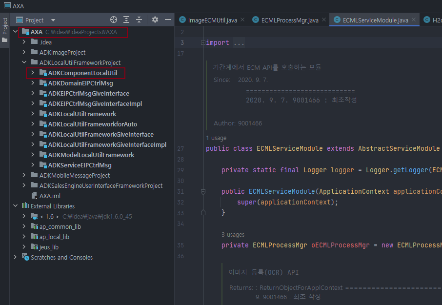

Markdown으로 문서작업 쉽게 하기 
===================  
    
<br>

[](https://creativecommons.org/licenses/by/2.0/kr/) 
본 웹사이트는 크리에이티브 커먼즈 저작자표시 2.0 대한민국 라이선스에 따라 이용할 수 있습니다.  

<br>

### 1. 개요
#### 1.1 최소한의 노력으로 문서 만들기 
MS Office로 복잡한 문서를 만들어야 할 때도 있지만 여튼 개인적으로 무엇인가를 빠르게 정리할 때는 Plain Text 파일 만큼 편리 한 것이 없다. 윈도우 메모장만 쓰지 않으면 암호화도 안 되니 여러모로 편리하다. 이러한 편리함은 유지한 채로 최소한의 노력으로 어느정도 갖춰진 문서(지금 보고 있는)를 만들 수 있다면  더욱 좋은 일이다. 무엇보다 복잡하고 까다로운 MS Office 대신 개발자에게 익숙한 Editor 프로그램 하나로 모든 문서를 만들 수 있다.

아래와 같은 목적으로 문서를 만들 것이면 마크다운(Markdown)이 딱 이다.   

* 대충 만들어서 그럴싸해 보이는 문서를 만들고 싶다.
* MS Office 같이 진지한 프로그램으로 문서를 만들기는 귀찮다.  
* java package 안에 BR이나 서비스 명세 등을 정리 해 둔다. 코딩 시 IntelliJ, Eclipse IDE 내에서 툴 전환 없이 바로 문서를 보고 수정 할 수 있다. 협업 시 작업내역 공유 방법으 매우 유용하다. 
* 웹, 모바일, 문서 사이즈로 부터 자유로운 반응형 웹과 같은 문서를 만들고 싶다. 
* Blog, Web 등을 통해 게시, 공유 하고 싶다.

복잡하고 정교한 편집을 원하는 문서(그냥 MS Word를 추천 드린다)에는 적합하지 않다. 대신에 최소한의 노력으로 그럴싸한 문서를 만드는데 목적이 있다. 따라서 마크다운 문법 자체가 복잡하지 않고 아주 많지도 않지만 모든 문법을 활용하여 다양한 스타일을 구사하기 보단 꼭 필요한 스타일로만 문서를 만들어 시간 효율을 추구하는 것이 바람직 하다. 
```
쉽게 말하면 표현 가능한 한정된 스타일에 내 문서를 맞춘다는 느낌으로 하면 정답이다.   
```

마크다운이 편리하긴 하지만 몇 가지 단점도 존재한다.  

* 프로그램에 따라 보여지는 모양이 조금식 틀릴 수 있다.
* 문법의 표준화가 덜 되어 있어 기본적인 문법 외 지원 정도가 어플리케이션 마다 틀림  
<br>

#### 1.2 Markdown 작성 도구
마크다운 문서를 작성하는 도구는 여러 가지가 있으며, 심지어 휴대폰에서도 작성 가능한 도구가 있을 정도다. 하지만 가장 추천 하는 도구는 Sublime Text 에서 작성 하는 것을 추천 한다. 일단 Editor 의 기본 기능이 뛰어나고 플러그인으로 실시간 Browser 확인 및 배포까지 가능 하다. 물론 IntelliJ Idea 나 Eclipse 등에서 작성하는 것도 좋은 방법이다. 단 Eclipse 는 버전에 따라 plugin 설치가 필요 할 수 있다.

* 참고: [Sublime Text 4 마크다운 설정](https://tansan5150.github.io/sltext/#53-markdown-optional)  


<br>

### 2. 제목 과 본문 쓰기
#### 2.1 문서를 처음 만들 것이니 제목을 붙여보자
제목으로 쓸 텍스트 바로 밑에  = 기호를 여러 개(2개 이상) 붙인다. 
```
이것은 문서 제목이다.
====================
```

그럼 이렇게 나온다.

이것은 문서 제목이다.
===============

글자도 크고 밑줄도 하나 생긴다. 제목으로 쓰기 딱 이다.  


\- 를 3개 이상 사용해 문서에 Line을 표현 할 수 도 있다.

```
-------------
```
아래와 같이 Line 이 표시 된다.
--------------

<br>

#### 2.2 이제 각 장, 절에 대한 제목을 봍여 보자
Plain Text 로 문서를 만들때와 동일 하다. 1,2,3,4,... 1.1, 1.2, 1.3,..., 가,나,다,... 원하는 대로 하면 된다. 단, 앞에 # 만 몇개 붙여 주자 그냥 그러면 끝이다. 단순하지 않은가?  
※ 주의: 마지막 #과 숫자/문자 사이에 공백 1칸 이상 있어야 한다.

```
# 1. 밥먹기
## 1.1 밥 많이 먹기
### 1.1.1 밥 아주 많이 먹기
#### 1.1.1.1 밥 아주 아주 많이 먹기
##### 1.1.1.1.1 밥 아주 아주 아주 많이 먹기
###### 1.1.1.1.1.1 밥 아주 아주 아주 아주 많이 먹기
```
이렇게 나온다.  
html 의 h1 ~ h6 태그에 대응되는 스타일이다. 

# 1. 밥먹기
## 1.1 밥 많이 먹기
### 1.1.1 밥 아주 많이 먹기
#### 1.1.1.1 밥 아주 아주 많이 먹기
##### 1.1.1.1.1 밥 아주 아주 아주 많이 먹기
###### 1.1.1.1.1.1 밥 아주 아주 아주 아주 많이 먹기

* 장,절 사용 예:  
개인적으로 \# 과 \## 은 문서 제목 만큼 큰 글자 스타일이라 \### 부터 시작하는 것을 선호한다.   
아래는 지금 보고 있는 문서의 사용된 예제이다..
```
### 1. 개요
#### 1.1 최소한의 노력으로 문서 만들기 
#### 1.2 Markdown 작성 도구
#### 1.3 Markdown 을 이용한 Blog 개시
### 2. 제목 과 본문 쓰기
#### 2.1 문서를 처음 만들 것이니 제목을 붙여보자
#### 2.2 이제 각 장, 절에 대한 제목을 봍여 보자
```
<br>

#### 2.3 본문 글을 작성 하자

##### 2.3.1 불필요한 들여쓰기 및 개행을 최소화 할 것  
마크다운의 매력은 코딩하다 plain text 로 대충 써서 만드는 편리함이다. 문단 들여쓰기 다단 스타일 등 문서의 편집과 모양에 상당시간 집중하는 것은 병맛이 될 수 밖에 없다. 따라서 들여쓰기도 안 하는 것이 최선이다. 심지어 4칸이상 들여쓰기를 할 경우에 자칫 Code Block 처리로 오인되어 표현 될수 있다. 몇 가지 규칙만 이해하고 들여쓰기 따위는 자동으로 되는 선에서 놔두자. 

직접 한 번 해보시라 아래 두 경우의 결과는 동일 하다.  
```markdown
바람직한 예:  
1. 불필요한 들여쓰기 및 개행을 최소화 할 것  
마크다운의 매력은 코딩하다 plain text 로 대충 써서 만드는 편리함이다.  
따라서 문단 들여쓰기 다단 스타일 등 문서의 편집과 모양에 상단시간 집중하는 것은 병맛이 될 수 밖에 없다. 

굳이 뭐하러의 예:  
1. 불필요한 들여쓰기 및 개행을 최소화 할 것  
    마크다운의 매력은 코딩하다 plain text 로 대충 써서 만드는 편리함이다.  
    따라서 문단 들여쓰기 다단 스타일 등 문서의 편집과 모양에 상단시간 집중하는 것은 병맛이 될 수 밖에 없다.
```
그리고 이렇게 난데 없이 들여쓰기를 하면 Code Block 으로 인식한다.  

```markdown
    마크다운의 매력은 코딩하다 plain text 로 대충 써서 만드는 편리함이다.  
    따라서 문단 들여쓰기 다단 스타일 등 문서의 편집과 모양에 상단시간 집중하는 것은 병맛이 될 수 밖에 없다. 
```
들여쓰기를 통한 Code Block은 모호함으로 인해 안 사용하는 것을 강추 한다.

##### 2.3.2 개행이 되지 않은 항목을 확인 할 것  
만약 이렇게 쓴다고 한다면  
```
마크다운의 매력은 코딩하다 plain text 로 대충 써서 만드는 편리함이다.
따라서 문단 들여쓰기 다단 스타일 등 문서의 편집과 모양에 상단시간 집중하는 것은 병맛이 될 수 밖에 없다.
```

아래와 같이 한 줄로 모두 붙어서 보일 수 있다.  

> 마크다운의 매력은 코딩하다 plain text 로 대충 써서 만드는 편리함이다.
> 따라서 문단 들여쓰기 다단 스타일 등 문서의 편집과 모양에 상단시간 집중하는 것은 병맛이 될 수 밖에 없다.

그런 경우 분리하고자 하는 문장 끝에 `Space` 2칸을 넣어준다. 위 문장들을 Copy 해 테스트 해 보자.  

##### 2.3.3 글자 간 띄어쓰기와 행간 띄어쓰기 
글자간 띄어쓰기는 1칸만 지원한다 실제 2칸 이상 띄워 써봐야 1칸 띄어쓰기 밖에 되지 않는다.
```
1. 글자를 띄어쓰자
2. 글자를  띄어쓰자
3. 글자를 &nbsp; 띄어쓰자
```

1번과 2번은 같은 결과가 나온다. 위에서 2칸 띄어쓰기를 하려면 3번과 같이 해야 한다.  
단, 뒤에서 설명 할 Code Block 안에서는 2칸 띄어쓰기가 가능하다.

행(line) 간 띄어쓰기도 마찬가지 규칙이 적용된다. 대부분 1줄 여백은 `Enter` 키로 표현 가능 하다. 하지만 2줄이상 행간을 넓혀야 한다면 `<br>` 또는 `<br/>` 태그를 사용해야 한다. 

`<br>`, `&nbsp;` 와 같이 html tag를 직접 사용하면 많은 기능 확장이 가능 하지만 꼭 필요한 경우 최소한의 범위에서 사용 하는 것이 좋다. 

<br>

### 3. 순서 및 열거 목록

#### 3.1 순서 목록 만들기
순서목록은 우리가 text 문서에서 글을 정리할 때와 마찬가자로 1. 2. 3. 과 같이 숫자를 그냥써서 목록을 만들면 된다. 참 쉬운 규칙이다. 하지만 몇 가지 고려 해야 할 사항들이 있다.

```
작성 시 1. 와 문자 사이에 반드시 한 칸의 공백이 필요하다.
```

순서 및 열거 목록은 마크다운 문서를 만들때 유일하게 들여쓰기 규칙이 적용되는 곳 이다. 아래 예제를 참조 한다.  
  
이렇게 쓰면
```markdown
1. 오늘 점심은 뭐 먹을까?  
오늘 점심 메뉴를 선택 하는 것은 직장인들의 중요 의사결정 과제 중 하나이다.  
오늘의 점심 메뉴는 직장 생활의 오후 일과를 좌우 한다.

2. 내일 점심은 뭐 먹을까?
    오늘 점심 메뉴를 선택 하는 것은 직장인들의 중요 의사결정 과제 중 하나이다.  
    오늘의 점심 메뉴는 직장 생활의 오후 일과를 좌우 한다.
```
실제 이렇게 나온다.  

1. 오늘 점심은 뭐 먹을까?  
오늘 점심 메뉴를 선택 하는 것은 직장인들의 중요 의사결정 과제 중 하나이다.  
오늘의 점심 메뉴는 직장 생활의 오후 일과를 좌우 한다.

2. 내일 점심은 뭐 먹을까?  
    오늘 점심 메뉴를 선택 하는 것은 직장인들의 중요 의사결정 과제 중 하나이다.  
    오늘의 점심 메뉴는 직장 생활의 오후 일과를 좌우 한다.

위 예제를 보면 `1.` 과 `2.` 을 사용한 순간 들여쓰기가 자동으로 된다. 또 부속 Text 또한 한번 더 들여쓰기가 된다.  
`1.`과 `2.` 항 아래의 부속 Text의 들여쓰기 한 것과 안 한 것의 결과가 동일함을 알 수 있다.  

다단계 순서 목록을 표현해야 하는 경우 아래와 같다.  
하부 순서 목록을 표현하는 방법은 들여쓰기를 이용한다.  

이렇게 쓰면
```markdown
1. 오늘 점심은 뭐 먹을까?  
오늘 점심 메뉴를 선택 하는 것은 직장인들의 중요 의사결정 과제 중 하나이다.  
오늘의 점심 메뉴는 직장 생활의 오후 일과를 좌우 한다.
    1. 중국집  
    중국집은 가장 만만한 점심 메뉴 중 하나이다.  
    가성비가 뛰어나고 접근성이 좋다.
        1. 자장면
            가장 많은 선택을 받는 메뉴이다. 
            짬뽕과의 선택에 있어 매우 심도있는 의사결정 과정을 거쳐야 한다.
     2. 스페인 음식점  
        부장님한테 혼난다.
```
실제 이렇게 나온다.

1. 오늘 점심은 뭐 먹을까?  
오늘 점심 메뉴를 선택 하는 것은 직장인들의 중요 의사결정 과제 중 하나이다.  
오늘의 점심 메뉴는 직장 생활의 오후 일과를 좌우 한다.
    1. 중국집  
    중국집은 가장 만만한 점심 메뉴 중 하나이다.  
    가성비가 뛰어나고 접근성이 좋다.
        1. 자장면  
            짬뽕과의 선택에 있어 매우 심도있는 의사결정 과정을 거쳐야 한다.
     2. 스페인 음식점  
        부장님한테 혼난다.  
   
첫 번째 숫자 목록은 들여쓰기를 하지 말고 좌측에 붙여서 사용 해야 한다.  
Sapce 4칸 정도의 들여쓰기를 하고 숫자 목록을 사용하면 현재 목록의 하부 목록으로 표현된다.  

<br>

#### 3.2 열거 목록 만들기

열거 목록의 경우 `*` 또는 `-` 기호를 사용한다. 순서목록과 마찬가지로 기호뒤 Spcae 1칸이 필수다.  
`*` 또는 `-` 기호를 중 하나만 사용 하거나 혼용해서 사용하는 경우 어떤 경우에도 결과는 동일하다. 

들여쓰기 및 표현 규칙은 순서 목록과 동일 하다.    

이렇게 쓰면
```markdown
* 오늘 점심은 뭐 먹을까?  
오늘 점심 메뉴를 선택 하는 것은 직장인들의 중요 의사결정 과제 중 하나이다.  
오늘의 점심 메뉴는 직장 생활의 오후 일과를 좌우 한다.
    * 중국집  
    중국집은 가장 만만한 점심 메뉴 중 하나이다.  
    가성비가 뛰어나고 접근성이 좋다.
        * 자장면  
            짬뽕과의 선택에 있어 매우 심도있는 의사결정 과정을 거쳐야 한다.
     * 스페인 음식점  
        부장님한테 혼난다.
```

실제 이렇게 나온다.

* 오늘 점심은 뭐 먹을까?  
오늘 점심 메뉴를 선택 하는 것은 직장인들의 중요 의사결정 과제 중 하나이다.  
오늘의 점심 메뉴는 직장 생활의 오후 일과를 좌우 한다.
    * 중국집  
    중국집은 가장 만만한 점심 메뉴 중 하나이다.  
    가성비가 뛰어나고 접근성이 좋다.
        * 자장면  
            짬뽕과의 선택에 있어 매우 심도있는 의사결정 과정을 거쳐야 한다.
     * 스페인 음식점  
        부장님한테 혼난다.

<br>

### 4. 강조 하기, 예제 설명 및 Code Block 

#### 4.1 단어 강조 하기

##### 4.1.1 Code Block 강조
글을 쓰다보면 특정 단어 등을 강조해야 할 일이 있다. 이 때 다음과 같이 \`를 사용해 Code block 강조법을 사용 한다.  
```
특정 단어 등을 `강조해야` 할 일이 있다.
```
특정 단어 등을 `강조해야` 할 일이 있다.

특히 단축키 표현 등에 유용하다.

* 예: `CTRL`+`ALT`+`DEL` 을 눌러 주세요.

##### 4.1.2 Bold 강조
Bold 처리를 위해서는 ** 기호를 사용한다.
```
오늘 점심은 **볼드볼드한 자장면**이 좋겠어  
```
오늘 점심은 **볼드볼드한 자장면**이 좋겠어  

##### 4.1.3 Italic 강조
하나만 쓰면 Italic 표현이 된다.
```
오늘 점심은 *이탤릭한 피자*가 좋겠어  
```
오늘 점심은 *이탤릭한 피자*가 좋겠어  

##### 4.1.4 Bold+Italic 강조
세개를  쓰면 Italic+Bold 표현이 된다.
```
특정 단어 등을 ***이탤릭하게 강조해야*** 할 일이 있다.
```
특정 단어 등을 ***이탤릭하게 강조해야*** 할 일이 있다.

##### 4.1.5 밑줄 쫙 강조
밑줄을 표현 할때는 html 식 태그를 사용해야 한다.
```
오늘 점심은 <u>짬뽕에 밑줄 쫙</u> 알지?  
```
오늘 점심은 <u>짬뽕에 밑줄 쫙</u> 알지?  

<br>

#### 4.2 Box 형 Code Block
\`\`\` 기호를 문단 시작 과 끝줄에 배치하여 아래와 같은 모양의 Code Block을 만든다.  
예제, 부연설명, Code 샘플 등을 표현 할 때 유용하다.

\`\`\`  
다음을 표현 할 때 유용하다.
  - 예제, 부연설명, Code 샘플 등   
\`\`\`  

```
다음을 표현 할 때 유용하다.
  - 예제, 부연설명, Code 샘플 등 
```

그리고 좀 더 재미있는 기능이 있는데 아래와 같이 코드블럭 상단에 문서 Type을 기재해 주면 Syntax Highlighting 을 지원한다. java, jsp, sql, json, xml, html, bash, csh, pyhon 등 여러 문서 타입의 Highlighting 을 지원한다. 물론 적용 어플리케이션이나 사이트에 따라 지원 여부가 달라 질 수 있다.    


\`\`\`java  

\`\`\`

```java
  @Override
    public void onApplicationEvent(ContextRefreshedEvent contextRefreshedEvent) {
      
      AuthModel authModel = new AuthModel();
      //TODO Property로 추출
      authModel.setUser_id("otadmin@otds.admin");
      authModel.setUser_pw("axa123");
      try {
        Map<String, String> rtnMap = serverInfoDao.mSelectAll();
        String realPath = servletContext.getRealPath("/");
        Properties properties = Property.prop;
        //Resource resource = new ClassPathResource("../config/common-config.xml");
        InputStream is = new FileInputStream(realPath+rtnMap.get("PROPERTIES_FILE"));
```

\`\`\`sql  

\`\`\`

```sql
SELECT D.* 
  FROM OTCS.UD_TASKCATEGORY A
     , OTCS.DTREECORE B --CBM002
     , OTCS.DTREECORE C --CBM00202
     , OTCS.UD_DOCUMENTCATEGORY D
WHERE 1=1
   AND A.NODE_ID = B.PARENTID
   AND B.DATAID = C.PARENTID
   AND C.DATAID = D.DOCTYPE_NODE_ID
   AND A.TASK_CD = 'cb'
   AND a.TASK_KEY1 = '2200087953' --사고번호
   AND A.CRT_DATE BETWEEN '20220101000000' AND '20220615000000'

```

<br>

### 5. Link 걸기  
#### 5.1 사용하면 좋은 Link
가장 간단한 방법은 URL 형태의 Link를 그냥 적으면 된다.  
https://devlap.axa.co.kr/devdocs/cert/   그러면 그냥 Link 로 인식 한다.

아래와 같은 방법으로 Link Label을 통한 표헌도 가능하다.

```markdown
[개발 도구 인증서 적용 가이드](https://devlap.axa.co.kr/devdocs/cert/)
```

[개발 도구 인증서 적용 가이드](https://devlap.axa.co.kr/devdocs/cert/)


또한 문서 내 이동 링크도 동일한 방법으로 사용할 수 있다.
링크 표현 시 #뒤에 순서목록 번호를 붙인다. 단 하부목록인 경우 어래와 같이 .을 제외하고 붙인다. 영문이 존재하는 경우 구분된 단어를 -로 소문자로 이어붙여서 표현한다.  


```
[3. 순서 및 열거 목록](#3)  
[이전장으로 이동](#4-code-block)
[Box형 코드블록](#42-box-code-block)
```

[3. 순서 및 열거 목록](#3)  
[이전장으로 이동](#4-code-block)  
[Box형 코드블록](#42-box-code-block)

<br>

#### 5.2 사용하지 않을수록 더 좋은 Link

아래와 같이 문서 내 이미지를 표시 할 수 있다. 절대경로 또는 상대경로를 사용하여 이미지의 위치를 표시 한다.  
앞의 링크와 사용 방법이 동일하며, 맨 앞에 !만 붙여주면 된다.


```markdown

```
아래와 같이 나온다.


아래와 같이 파일 다운로드의 용도로도 사용 할 수 있다.

```markdown
[다운로드](./file.txt)
```

[다운로드](./file.txt)

이러한 링크의 사용은 해당 이미지나 파일을 문서 배포시마다 같이 포함되어 배포해야 한다. 그리고 디렉토리 구조 또한 유지해야 한다. 따라서 간단한 문서 작성이라는 본래의 취지보다 좀 더 웹페이지에 가까워지게 된다. 개인 Blog 작성 또는 비교적 공적인 문서를 만들때는 좀 더 유용 할 수 있지만 마크다운의 본질적 편의성을 많이 훼손하는 방법이므로 꼭 필요하지 않으면 사용 하지 않는 것을 권장 한다.  

<br>

### 6. 꼭 필요 하지 않은 기능들  

#### 6.1 인용구 쓰기
인용구, 부연 설명 등을위해 아래와 같이 인용구 형식의 표현이 가능하다.  
필요한 경우 사용하는 것도 좋으나 귀찮으면 Code Block 표현법으로 모든 예, 부연 설명을 통일 하는 것도 좋은 방법이다. 큰 차이가 있다면 Code Block 은 Style, 태그 등을 무시하는 반면 인용구는 표현 가능하다. 

```
오늘 점심은 뭐 먹을까?
> 오늘 점심은 **볼드볼드한 자장면**이 좋겠어  
> 오늘 점심은 *이탤릭한 피자*가 좋겠어
```
오늘 점심은 뭐 먹을까?
> 오늘 점심은 **볼드볼드한 자장면**이 좋겠어  
> 오늘 점심은 *이탤릭한 피자*가 좋겠어

#### 6.2 표 만들기
마크다운에서 표를 사용 할 수도 있다.  마치 Text 로 표를 그리듯이 만들어 주면 된다. 표 내에서 공백의 갯수는 실제 의미가 없다. 실제 Column 의 크기는 글자수에 의존하여 자동으로 설정 된다.  

필드 내 문자 정렬 방법       

* :---- 왼쪽 정렬(Default)  
* ----: 오른쪽 정렬
* :----: 가운데 정렬


```
|번호 |메뉴           |가격    |만족도|
|-----:|-------------|-------:|:----:|
|1     | 자장면       | 8,000 |   상 | 
|2     | 차돌해물 짬뽕| 12,000|    중 | 
|3     | 샥스핀      | 132,000 | 최상 |  
```

|번호 |메뉴              |가격      |만족도|
|-----:|----------------|----------:|:-----:|
|1     | 자장면           | 8,000   |   상 | 
|2     | 차돌해물 짬뽕| 12,000 |   중 | 
|3     | 샥스핀        | 132,000 | 최상 | 

#### 6.3 표지와 목차
마크다운은 단순 간결함이 생명이긴 하지만 그래도 표지와 목차 같은 격식이 때로는 필요 할 수 있다. 그런 경우 너무 복잡하지 않은 선에서 Template을 하나 만들어 두고 복사해서 사용하면 유용하다.  
마크다운 문서인 만큼 너무 고민해서 편집에 몰두하지 말고 적당히 만들자. 복잡한 편집을 원하는 순간 html 태그와 css 가 문서 내 난무하게 된다.  

아래는 본 문서의 표지와 목차의 사용예다.   

```markdown
Markdown Quick Start Guide 
===================  
<br> <br> <br> <br> <br> <br> <br> <br>
  
  >   * `author by 안진모`    
  >   * `up to date 2023.05.03` 
    
<br>
<br>
  Copyright ⓒ2023 AXA General Insurance Korea Co.,Ltd. All Right Reserved.

<br>  
--------------------------------------
<br>  

### 목차
<br>
  > &nbsp; [1. 개요](#1)   
  > &nbsp; [2. 제목 과 본문 쓰기](#2)   
  > &nbsp; [3. 순서 및 열거 목록](#3)   
  > &nbsp; [4. 강조 하기, 예제 설명 및 Code Block](#4-code-block)   
  > &nbsp; [5. Link 걸기](#5-link)  
  > &nbsp; [6. 꼭 필요 하지 않은 기능들](#6)   

  <br> <br> <br> <br>
--------------------------------------
```


