Sublime Text 4 Users' Guide
===================  
    
<br>

[](https://creativecommons.org/licenses/by/2.0/kr/)  
본 웹사이트는 크리에이티브 커먼즈 저작자표시 2.0 대한민국 라이선스에 따라 이용할 수 있습니다.

<br>

### 1. 설치   
#### 1.1 프로그램 설치  
>  1. `sublime_text_build_41xx_x64_setup.exe` 를 설치  
>  2. 설치 시 `Add to explorer context menu` 가 나오면 Check 해 준다(우측 클릭 문서열기 기능).

#### 1.2 Plugin 설치
>  1. Sublime Text 를 실행 후 바로 종료 한다. Plugin 디렉토리는 최초 실행 후 생성된다. 
>  2. 추가 플러그인 설치를 위해 `Installed Packages.zip` 와 `Packages.zip` 파일을 압축 해제 한다.  
>  3. `C:\Users\사번\AppData\Roaming\Sublime Text` 폴더에 `Installed Packages` 와 `Packages`  두 폴더를 삭제 한다.   
>  4. 압축 해제한 `Installed Packages` 와 `Packages` 폴더를 복사 한다.  
>  5. 만약 위 폴더에 `Sublime Text` 가 없는 경우 `C:\Users\master\AppData\Roaming\Sublime Text` 의 경로를 사용 한다.

#### 1.3 License 등록
> 1. Help > Enter License  메뉴를 실행 후 제공받은 License Key 내용을 모두 복사하여 붙여 넣는다.
> 2. SFTP  Plugin License 등록: Command Palette `CTRL`+`SHIFT`+`P` > sfl 입력 > `SFTP: Enter License Key` 선택 후 하단에 생긴 License Key 입력 항목에 제공된 키를 붙여 넣는다.
 
<br><br>

### 2. 환경 설정
#### 2.1 Command Palette 에서 설치된 패키지 확인
Sublime Text의 메뉴 기능 또는 설치된 플러그인 패키지의 관리, 플러그인 기능 사용 등 많은 것을 Commnad Palette 에서 할 수 있다. 예를 들면 SVN, GIT 으로 Checkout, Commit 또는 Clone 등을 할 때  Command Palette에서 한다.
>  `CTRL` + `SHIFT` + `P` : Command Palette 띄우기

다음 예제를 통해 1번에서 복사하여 설치 한 플러그인 목록을 살펴보자. 
>  1. Command Palette 에서 다음을 입력한다 `pclp`   
>  2. Package Control: List Packages 와 같이 입력 할 수 있으나 앞 글자만 입력 해도 자동완성 되는 편리한 특징이 있음    
>  3. `Package Control: List Packages` 가 보이면 선택, 설치된 패키지 목록이 보인다.

이 중 `Package Control` 은 제작사에서 제공하는 Plugin 이며, 일반적으로 Sublime Text 를 설치 후 가장 먼저 설치해야 하는 필수 플러그인 이다. `Package Control`을 통해 외부 Plugin을 설치하고 관리 할 수 있다. 우리가 사용하는 업무망, 관리망은 인터넷이 되지 않는 환경 이므로 패키지를 인터넷 PC에서 옮겨서(복사) 설치 해야 한다. `1.2 Plugin 설치` 항목을 수행 했으면 이미 설치되어 있다.

<br>

#### 2.2 EUC-KR 한글 Encoding 관련 사항
Sublime Text는 EUC-KR Locale을 기본적으로 지원 하지 않는다. 따라서 이를 위해 `ConvertToUTF8` 플러그인의 설치가 필요하다. 2.1의 List Packages로 확인 해 보면 우리가 복사한 플러그인 모음에 이미 들어가 있다.   
> 1. EUC-KR 설정: File > Set File Encoding To > Korean (EUC-KR)  
> 2. EUC-KR로 다시 읽기: File > Reload with Encoding > Korean (EUC-KR)

Sublime Text는 `File` 메뉴의 `Reopen with Encoding` 과 `Save with Encoding`을 통해 Locale 변환 기능을 제공한다. EUC-KR의 경우 기본 제공 기능이 아니므로 Plugin 설치 후 별도의 메뉴가 생긴다.

<br>

#### 2.3 폰트 설치 (Optional)
필요한 경우 설치본 디렉토리 내 fonts 폴더에 있는 폰트 중 원하는 폰트를 설치한다. Coding 관련 인기 인는 폰트들임.  

  - 나눔고딕 : 가변폭  
  - 나눔고딕코딩 : 고정폭  
  - D2 Coding: 고정폭  

<br>

#### 2.4 Theme 및 Color Scheme
기본 적으로 Preferences 메뉴를 통해 할 수도 있지만 Command Palette 를 사용하면 편리하다.  

1. Editor 창  Text 색깔 표현 - `Monokai` 색상이 Default 이며 Sublime Text의 상징과도 같은 Color Scheme. `Mariana` 색상은 부드럽고 미려한 색상으로 인기가 많은 Color Scheme.
>  `CTRL`+`SHIFT`+`P` > `usc` 입력 > `UI:Select Color Scheme` 선택

2. 프로그램의 Color Theme 선택 - 시력 보호를 위한 다크모드 등을 선택 할 수 있다. 
>  `CTRL`+`SHIFT`+`P` > `ust` 정도 입력 > `UI: Select Theme` 선택

<br>

####  2.5 환경 설정

Sublime Text의 전반적인 설정을 관리한다. 
> 메뉴에서 Preferences > Settings  
> 또는 Command Palette `CTRL`+`SHFT`+`P` > `ps` 입력 > `Preferences: Settings` 선택

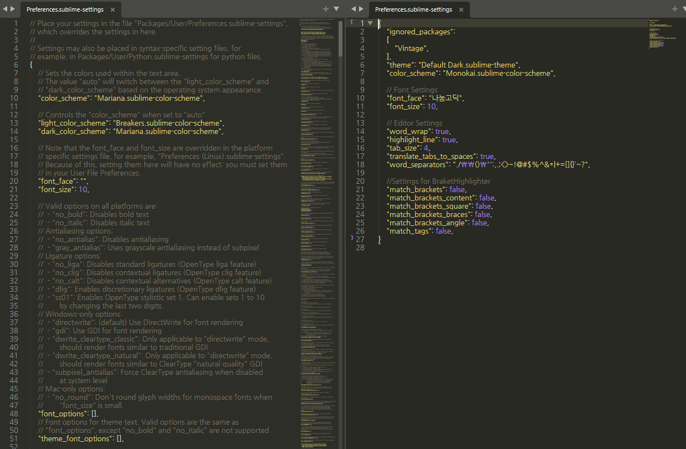


처음에는 이러한 방식이 낯설 수도 있는데 익숙해 지면 매우 편리하다. 왼쪽에 열리는 창은 수정 불 가능한 Default 설정 이고 이 설정을 참고 하여 원하는 설정을 오른쪽 창에 json 형식으로 Overriding 하듯 복붙하고 수정해 주면 된다. 오른쪽 창의 항목을 빼면 즉시 원래 설정으로 되돌릴 수 있다.  
아래의 //Font Settings 이하 부분을 복사하여 붙여넣고 필요 항목 수정 후 저장하면 즉시 저장 된다. 환경설정 파일 수정이 끝나면 `CTRL+W` 로 창을 닫으면 된다.  

```json
{
    "ignored_packages":
    [
      "Vintage",
    ],
    "theme": "Default.sublime-theme",
    "color_scheme": "Monokai.sublime-color-scheme",

    //Font_Settings
    "font_face": "나눔고딕", 
    "font_size": 11,

    //Editor_Settings
    "word_wrap": true,
    "highlight_line": true,
    "tab_size": 4,
    "translate_tabs_to_spaces": true,
    "word_separators": "./\\()\"':,.;<>~!@#$%^&*|+=[]{}`~?",

    //Settings_for_BraketHighlighter
    "match_brackets": false,
    "match_brackets_content": false,
    "match_brackets_square": false,
    "match_brackets_braces": false,
    "match_brackets_angle": false,
    "match_tags": false,
    "update_check": false,
}
```

  - "ignored_packages" ~ "color_scheme" 은 자동 생성 항목 임.  
  -  Font 를 바꾸지 않는 경우 해당 항목은 제외 한다. 제공된 폰트 사용시 폰트 명은 아래와 같은 이름으로 설정 할 수 있다.
    * "font_face":"나눔고딕코딩", 
    * "font_face":"D2Coding", 
  - "word_separators" 의 항목은 더블클릭으로 단어를 선택 했을 때의 경계를 의미한다. 예를들어 . 을 빼면 파일명 선택 시 확장자를 포함 한 번에 선택이 가능하다.  
  - //Settings for BraketHighlighter 이하 항목은 Braket을 좀 더 잘 표시해 주는 Plugin인 BraketHighlighter의 설정이 기본 기능과 충돌이 나지 않게 하기 위한 설정이다. 그냥 그대로 넣어 주자.  

<br>

####  2.6 환경 설정 - Chrome 실행 설정(html/Javascript)
html, javascript 등 웹 관련 작성 후 바로 확인 하기 위해 빌드 항목에 브라우저 항목을 추가 한다.  
Chrome의 예 이며 Edge, IE 도 같은 방법으로 가능하다.    

  > 1. Build System -> New Build System 선택
  > 2. 다음과 같이 입력   

    {  
        "cmd": ["C:\\Program Files (x86)\\Google\\Chrome\\Application\\chrome.exe","$file"]   
    }

  > 3. Chrome.sublime-build 로 저장
  > 4. `CTRL`+`B` 로 실행 (처음만 `Chrome` 입력)

<br> <br>

### 3. 기본 사용법  

#### 3.1 파일/프로젝트 탐색 Side Bar
Side Bar에 작업 폴더를 등록하여 사용하면 편리하다.
최초 실행시 메뉴에서 한번 실행 해 줘야 한다
  > 메뉴: `View` > `Side Bar` > `Show Side Bar`  
  > Side Bar: 보이기/숨기기: 이후 `CTRL`+`K`, `CTRL`+`B`  (`CTRL`을 누른채로 `K` , `B` 연속 입력) 사용 가능

  관리하고자 하는 폴더를 Drag 하여 Side Bar에 Drop 시킨다.
  >  참고:  예를 들면 `workdir` 이란 폴더를 만들고 Side Bar에 등록 한다.  
  >  이후 그 밑에 프로젝트 또는 업무별로 폴더를 추가 한다.  
  >  탐색기 또는 Sidebar 어디에서나 만들 수 있다.   

  이러한 모습이 되며, 최근 연 파일 및 작업 폴더 내 파일을 편리하게 탐색, 편집 할 수 있다.
  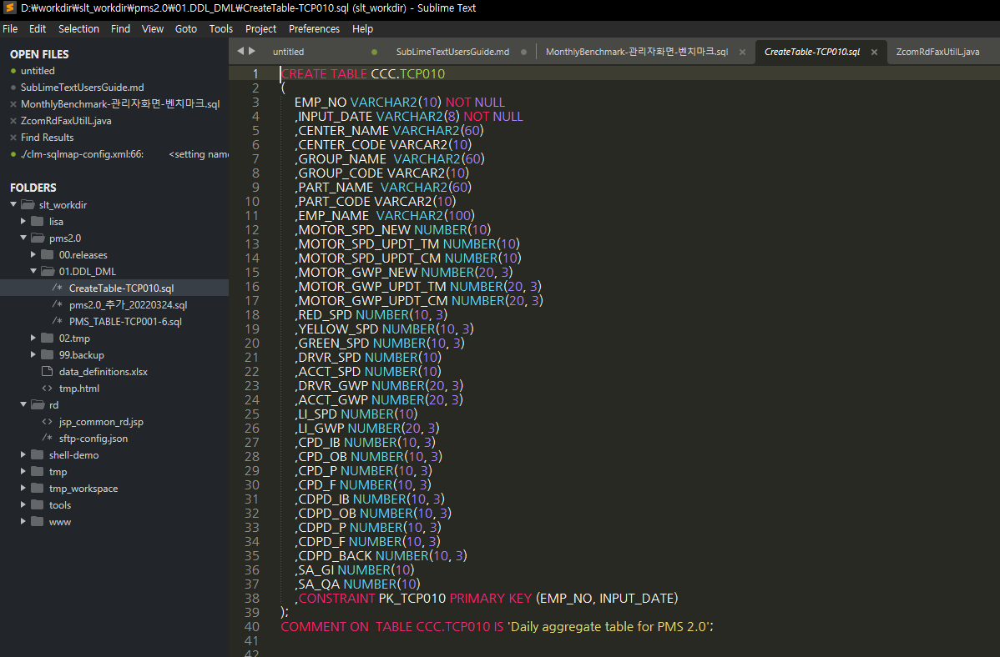


```
  ※ [TIP] 특이한 기능: Sublime Text에서는 .png 등의 이미지 파일을 직접 열어 볼 수 있다.  
```

<br>

#### 3.2 탭, 화면 조작
1. 탭 이동 
    - 탭이동(Historical): `CTRL`+`TAB` 
        * `CTRL` 을 누른채로 `TAB` 을 여러번 치면 바로직전, 전전, 전전전 탭으로 얼여본 순서에 따라 이동 
        * 키보드에서 손을 떼고 잠시 있은 후 다시 `CTRL`+`TAB`을 누르면 현재 Tab을 기준으로 전, 전전 순서로 동작  
  - 탭이동(Linear): `CTRL`+`PGUP`/`PGDOWN`
  - 탭이동(번호순): `ALT`+`숫자` (왼쪽탭부터 순서대로)  
  <br>
2. 창 분할
    - 창분할: `CTRL`+`탭클릭` (선택 한 탭 수 만큼 분할)
    - 창분할 해제: `CTRL`+`탭클릭` (이미 분할된 탭중 하나를 클릭)
    - 창분할(또 다른 방법): `ALT`+`SHIFT`+`2` (분할할 창 수) > 원하는 탭을 오른쪽 빈분할 창으로 드래그
    - 창분할(또 다른 방법) 원복: `ALT`+`SHIFT`+`1`   
  <br>
3. 화면 확대/축소
    - 전체 화면 : `F11`
    - 집중모드: `SHIFT`+`F11`  
    - 화면 확대/축소: `CTRL`+`-`/`+`  또는 `CTRL` +`마우스휠`

<br>

#### 3.3 Editing 기본 
매우 자주 사용 하게 될 기능 으므로 확실하게 익혀두길 권장 합니다.

1. Line 선택/이동  
    - 한 줄 선택 : `CTRL`+`L` (계속 입력 시 다음 줄 선택)
    - 라인 위/아래로 이동 - 한 줄 or 블럭 : `CTRL`+`SHIFT`+`UP`/`DOWN`   
    <br>
2. Line 추가/삭제/합치기    
    - 아래로 한 라인 추가 : `CTRL`+`ENTER` (행 내 아무 곳에서나 사용 가능 하여 편리)   
    - 위로 한 라인 추가 : `CTRL`+`SHIFT`+`ENTER`
    - 현재 라인 삭제 : `CTRL`+`SHIFT`+`K` 
    - 현재 라인 바로 아래 복사 : `CTRL`+`SHIFT`+`D` 
    - 한 줄로 합치기 : `CTRL+SHIFT+J` (바로 아랫줄과 합쳐짐)  
    <br>
3. 들여쓰기, 내어쓰기    
    - 행 들여쓰기: 블럭 선택 후 `TAB` , 내어쓰기:  블럭 선택 후 `SHIFT`+`TAB` 
    - 코드 들여쓰기/내어쓰기: `CTRL+L` 등으로 줄 선택 후 `TAB` / 줄 선택 후 `SHIFT+TAB`   
    <br>
4. 기타    
    - 대소문자 변환 : 블럭 선택 후 `CTRL`+`K` -> `U` 또는 `L`  (`CTRL`을 누른채로 `K` , `U` 연속 입력) 
    - Bracket, Brace 범위 안 선택: `CTRL`+`SHIFT`+`M`   
    <br>

  - 실습 예제1: 한번에 5줄 복사하기
  > 1. `CTRL`+`L` 을 5번눌러 5줄 선택   
  > 2. `CTRL`+`SHIFT`+`D` 로 바로 아래 복사   
  > 3.  `CTRL`+`SHIFT`+`UP`/`DOWN` 으로 적정 위치 이동

  - 실습 예제2: 들여쓰기, 내어쓰기
  > 1. `CTRL`+`L` 을 여러번 눌러 여러 줄 선택   
  > 2. `TAB` 과 `SHIFT`+`TAB` 을 여러번 눌러 들여쓰기 내어쓰기 조정
  > 3.  `CTRL`+`K` -> `U` 로 대문자로 모두 변환 
  > 4. `CTRL`+`SHIFT`+`K`  로 삭제

<br>
#### 3.4. 검색 기능
UltraEdit 와 같은 구식 Editor 와 많은 차이가 나는 부분 중 하나가 편리한 검색 기능이다. 단축키 몇 개로 빠르고 편리한 찾기와 검색을 해 보자. 

##### 3.4.1 기본 검색 기능
  - 찾기: `CTRL`+`F` (범위 검색, 대소문자 구분, 정규식 사용 등 가능)
  - 바꾸기: `CTRL`+`H`  

##### 3.4.2 Go Anything(어디로든 이동): `CTRL`+`P` 
  * 왼쪽 Side Bar에 등록 된 모든 폴더 내 특정 문서 나 소스를 열고 싶을 때 여기에 생각나는 대로 단어를 치면 된다.
  * 예: ZcomStringUtilL.java 를 열어보고 싶을 때, 하지만 어디 있는지 찾기도 귀찮고 이름도 정확히 모르겠을 때, `CTRL`+`P` 를 누르고 `str` 정도 대충 입력하면 아주 쉽게 찾을 수 있다.  
    * 단어가 매칭되어 나오는 항목을 위,아래로 선택하면 화면에 실제 파일이 내용이 보여진다. 빠르게 훑어 볼 때 매우 유용.
    * [Tip] 특정 확장자를 찾고 싶을 때 `.jsp` 와 같은 방식으로 사용하면 유용하다.
    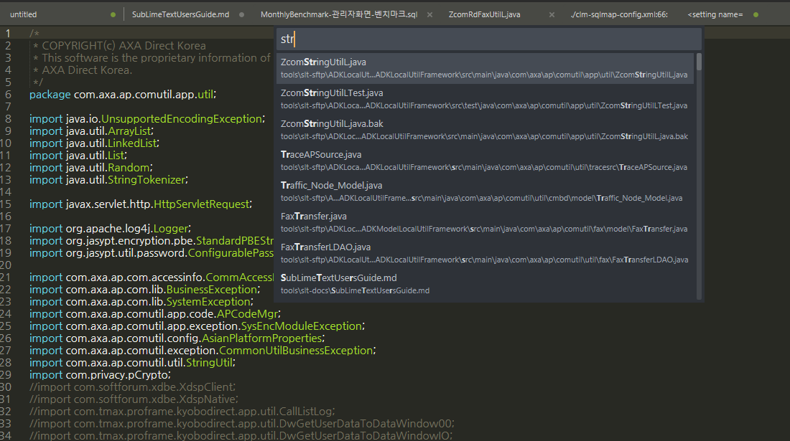


  * `@단어` 로 Method, Function 또는 멤버 변수 찾기
    * Javascript, jsp 또는 java 파일을 열었을 때 method 나 function 으로 이동 할 때 매우 유용. 
    * 소스코드를 하나 열고, `@단어` 형식으로 단어에 이동하고자 하는 method나 function 명을 생각나는 대로 대충 쳐보자.
    * 위, 아래로 커서를 움직일 때 마다 해당 function 으로 빠르게 이동 한다.  
    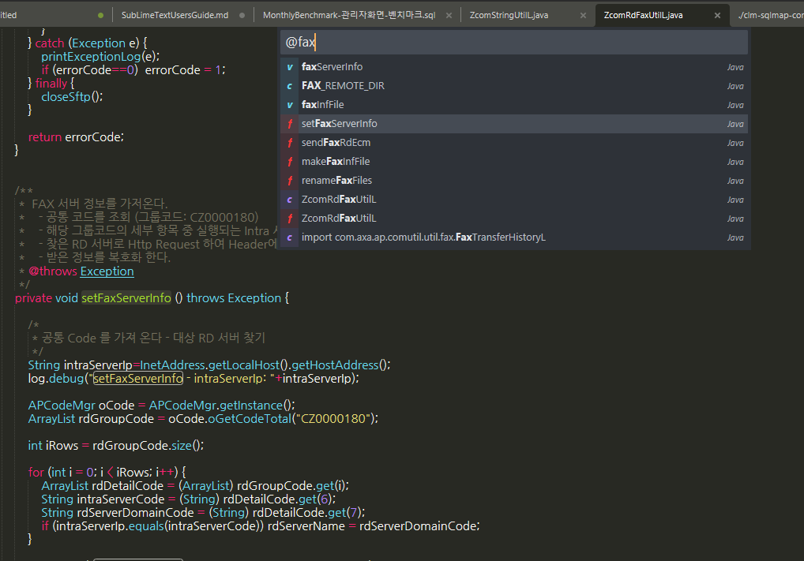


  * `#단어` 로 문서 내 특정 단어 찾기  
      - 문서 내 특정 단어를 찾아 빠르게 이동 할 수 있다.
      - 예: `#바나나`

  * `:숫자` 로 문서 내 Line 으로 이동 하기  
      - 문서 내 특정 Line 으로 빠르게 이동 할 수 있다.
      - 예: `:124` 

##### 3.4.3 디렉토리 안 모든 파일에서 단어 찾기: `CTRL`+`SHIFT`+`F` 
  * Unix/Linux의 find | grep 조합과 같은 기능이다. 특정 폴더를 지정하면 안에 있는 모든 파일에 대해 단어 검색을 할 수 있다.
    * `Where` 항목에 직접 적거나 우측 `...` 버튼을 클릭 > `Add Folder` 하여 검색 시작 폴더를 지정 한다.  
    * `Find` 항목에 찾고자 하는 단어를 입력 한다.  
    
    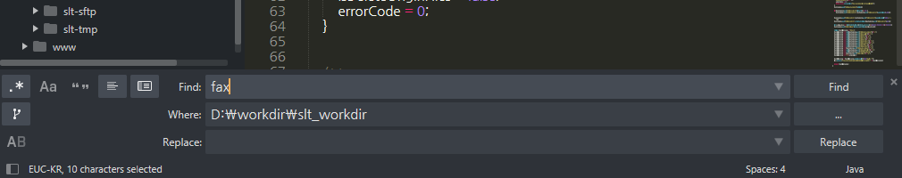

    * 검색 결과가 Find Results 탭에서 상세하게 나온다.
    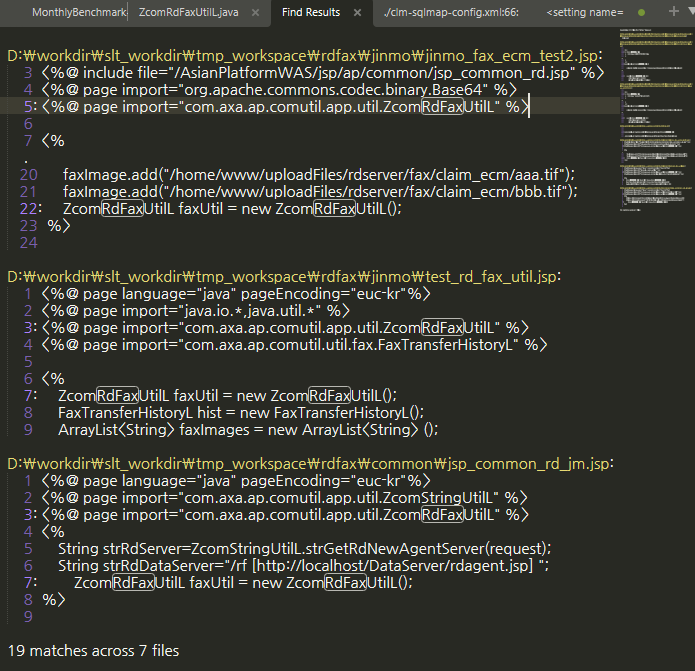

  * 특정 확장자 파일만 검색을 하는 경우  
    * `...` 버튼 클릭 > `Add Folder` > `Add Include Filter`  > 원하는 확장자로 변경
    * `Find` 항목에 정규식(Regex)을 사용 할 수 있다. 
  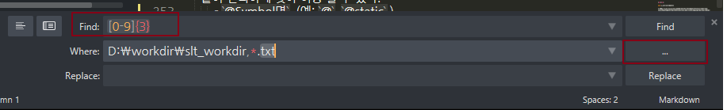

  <br>
##### 3.4.4 Command Palette: `CTRL`+`SHIFT`+`P` 
  * Sublime Text 의 메뉴 또는 제공하는 기능 및 명령어를 실행 한다.  

<br><br>

### 4. 다중 선택, 세로 열 편집

#### 4.1 다중 선택
다중 선택은 여러분의 단순 반복 작업 시간을 줄여 준다. 반복되는 같은 단어나 문장을 하나 하나 고치는 노가다는 개발자에게 죄악과도 같은 것 이다.

  - 단어 다중 선택: `CTRL`+`D` 
    * 현재 커서 위치 또는 더블클릭 또는 단어 범위를 직접 선택 후 `CTRL`+`D`   
    * `CTRL`+`D` 반복 입력 하여 필요 한 만큼 선택 한다.
  - `CTRL`+`D` 단어 선택 해제: `CTRL`+`U`
    * 선택한 단어를 역순으로 하나씩 빼면서 선택 해제 한다. 
  - `CTRL`+`D`  연속선택 시  선택 제외: `CTRL`+`DK` (DK 연속 입력)
  - 다중선택(마우스): `CTRL`+`SHIFT`+`우측클릭`, 임의 위치 다중 선택 시 유용 
  - 다중선택(마우스) 빼기: `ALT`+`SHIFT`+`우측클릭`
  - 특정 단어 전체 선택: `ALT`+`F3`    
  - 다중선택 전체 해제: `ESC`        
  - 다중선택 시 대소문자 구분: `CTRL`+`F` > `ALT`+`C`  그 다음 `CTRL`+`D`를 연속해 선택 또는 `ALT`+`F3`  
  - 실습 예제1: 모든 변수명 뒤에 111추가 하기
  > 1. java 소스코드를 하나 열어 자주 쓰이는 변수명 중 하나 에 커서를 위치 시킨다.
  > 2. `ALT`+`F3` 을 눌러 전체 선택   
  > 3. 우측 커서를 한번눌러 단어 마지막에 위치 후 111을 입력

- 실습 예제2: 모든 변수명 중 몇 개 빼고 변경 하기
  > 1. 자주 쓰이는 변수명 중 하나 에 커서를 위치 시킨다.   
  > 2. `CTRL`+`D`  를 눌러 단어를 선택 한다.
  > 3. `CTRL`+`DK` 를 눌러 그 다음 단어는 빼고 선택 한다.
  > 4. 2~3 을 적절히 반복하여 부분적으로 단어 선택을 한다.    
  > 5. 선택된 단어를 변경 한다.

<br>

#### 4.2 열(세로) 편집
문단의 시작 뿐만아니라 끝 부분만 커서를 위치 시켜 동시 편집이 매우 편리하다. 뿐만 아니라 어느정도 규칙성만 있다면 중간 부분의 서로 길이가 다른 열 편집도 가능 하다.

  - 세로열 선택(키보드): `CTRL`+`ALT`+`UP`/`DOWN` 
  - 세로열 선택(마우스): `SHIFT`+`우클릭 드래그`
  - 세로줄 또는 문장 마지막 편집: `CTRL`+`SHIFT`+`L` 
  - 실습 예제: 10 줄 선택 후 문장 마지막에 단어 추가 하기
  > 1. java 소스 또는 각 행의 끝 부분 길이가 다른 파일 하나를 연다
  > 2. `CTRL`+`L` 을 10번 눌러 10줄 선택   
  > 3. `CTRL`+`SHIFT`+`L`  를 누른 후 우측 커서를 누른다(반대로 최측을 누르면 문장 처음 선택).
  > 4. 문장 끝에 단어를 추가 한다.

  - 참고: Code 들여쓰기를 위해 열 편집을 사용 할 수도 있지만 이 보다는 문장 선택 후 `TAB`과 `SHIFT`+`TAB`을 이용 하는 편이 더 쉽다. 

<br><br>

### 5. 개발 관련 기능

#### 5.1 Coding 관련 기능

##### 5.1.1 자주 쓰는 기능
  - 자동완성: `CTRL`+`SPACE` (자동완성 선택은 `TAB` 키 사용)
  - 블럭 주석/취소 : `CTRL`+`SHIFT`+`/`
  - 한줄 주석/취소 : `CTRL`+`/`
  - 코드 펴기/접기 : `CTRL`+`SHIFT`+`[`, `CTRL`+`SHIFT`+`]`   
  - 콘솔(하단) 열기 닫기: `CTRL`+ \`

##### 5.1.2 부가 기능   
  - md문서 미리보기: `CTRL`+`B`
  - Hex Editor: `CTRL`+`SHIFT`+`H`
      * Edit를 위해서는 Package Control 이용
      * Byte 변경: HexViewer: `Show Hex Edit Panel` (hve)
      * 변경내용 저장: `HexViewer: Export Bin` (hvb)
  - node.js 실행: `ALT`+`R`    

##### 5.1.3 열 Sorting 하기
  - 오름차순 정렬(대소문자 구분 X):  `F9` (또는 `Command Palette` > `Sort Lines`)
  - 오름차순 정렬(대소문자 구분 O):  `CTRL`+`F9` (또는 `Command Palette` > `Sort Lines(Case Sensitive)`)
  - 내림차순 정렬: `Command Palette` > `Permute Lines: Reverse`
  - 랜덤 정렬:  `Command Palette` > `Permute Lines: Shuffle`
  - 중복 값 제거:  `Command Palette` > `Permute Lines: Unique`

  <br>
  - 실습 예제: Snippets(자동완성)을 이용한 html 작성  
  > 1. `CTRL`+`N` 으로 빈 문서를 하나 만든 후 적절한 곳에 demo1.html 이란 이름으로 저장 한다.
  > 2. 문서 상단에 html 입력 후 `ENTER` 대신 `TAB` 키를 입력
  > 3. title 이 있는 줄에서 `CTRL`+`ENTER` 로 줄 바꾸기 
  > 4. script 입력 후 `TAB`
  > 5. body 또는 script를 적당히 채워 넣은 후 저장(할 거 없음 고민하지 말고 Hello World)
  > 6. `CTRL`+`B`  를 눌러 브라우저에서 확인

<br>

#### 5.2 파일 비교 - diff 기능   
1. Editor 기본 제공 기능 - Unix 스타일 Diff 제공
  > 우측 Side Bar 에서 비교 할 파일 2개를 `SHIFT`+`좌측클릭` 선택 후 마우스 우측 클릭 하여  `Diff Files` 를 선택

2. Plugin 을 사용한 Diff 기능
  > 1. 비교할 두 문서가 탭에 열려 있어야 함
  > 2. 현재 선택된(열려진) 탭과 다른 탭을 비교하는 방식: 비교 할 대상의 탭 위에 `우측클릭` > `Compare with Active Tab` 선택
  > 3. 비교대상 2개가 오른쪽으로 쏠려 나옴(버그) > `확인` Popup을 닫고 > `CTRL`+`SHIFT`+`1` (또는 오른쪽 2개 탭 중 하나를 드래그 하여 왼쪽 영역으로 이동)
  > 4. 파일 비교 후  `ALT`+`W`로 창을 닫음

3. Remote 파일과 PC Local 파일의 비교
예를 들면 개발서버에 있는 파일과 PC에 있는 파일을 Plugin Diff 기능을 이용하여 편리하게 비교 할 수 있다.
  > 1. 먼저 Local에 있는 파일을 Sublime Text에서 연다.
  > 2. 열린 Local 파일의 화면에서 Command Palette `CTRL`+`SHIFT`+`P` > `SFTP: Browse Remote Server…` (sbr 입력) 선택 후 원격 파일을 연다.  (`6. SFTP 로 작업 하기` 참조)
  > 3. 두 탭 중 하나의 탭 위에 `우측클릭` > `Compare with...` 선택
  > 4. 현재 열려 있는 탭의 목록이 나오며, 비교할 또 다른 탭을 선택 한다.
  > 4. 비교대상 2개가 오른쪽으로 쏠려 나옴 > `확인` Popup을 닫고 > `CTRL`+`SHIFT`+`1` (또는 마우스 드래그)
  > 5. 파일 비교 후  `ALT`+`W`로 창을 닫음

<br>

#### 5.3 Markdown 문서 작성 (Optional)   
지금 보고 있는 문서와 같은 형태의 문서를  Sublime Text에서 간단하고 빠르게 만들고 싶다면 markdown 을 이용해 다음과 같이 작성 할 수 있다.  

1. Preferences > Package Settings > Markdown Preview >Settings 실행 후 User 에 다음 내용 추가.
       새로 열린 문서에 다음을 입력한다. 
```json
{
    "enable_mathjax": true,
    "html_simple": false,
    "browser": "C:/Program Files (x86)/Google/Chrome/Application/chrome.exe", 
    "enable_autoreload": true,
    "path_tempfile": ".",
    "image_path_conversion": "none",
    "file_path_conversions": "none",
    "build_action": "browser",
}
``` 
> * "browser": 기본 브라우저 Chrome 지정 예시  
> * "enable_autoreload": true 인 경우 F5를 사용하여 reload 가능  
> * "path_tempfile": 미리보기 시 html 임시 파일 위치, 위와 같이 지정 시 현재 폴더에 nn.html 과 같은 형태로 생성  
> * "image_path_conversion", "file_path_conversions": "none" 지정 하지 않을 시 Windows의 Path 가 html 내 지정 됨  
> * "build_action":  browser 는 지정 browser에서  열리며 nn.html 파일 성성, save 는 .md 와 동일이름 .html 파일만 생성  

2.  기본 사용법
> 1. 저장 : markdown 문서 작성 후 .md 또는 .markdown 확장자로 저장   
> 2. 빌드 : `CTRL`+`B` - .html 파일이 생성 및 지정된 브라우저에서 열린다.  
> 3. Refresh : 문서 수정  후 브라우저에서 `F5`  
      
<br>

#### 5.4 Binary 수정 - HexViewer (Optional)     
1. `Preference: Key Bindings` 의 우측 User 설정 변경 - 아래 내용 { } 단위 전체 추가
```json
{ 
    "keys": ["shift+ctrl+h"], 
    "command": "hex_viewer" 
} 
```

2. 고정폭 폰트로 변경 : Preferences HexViewer Settings - User  
```json
{
    "custom_font" : "Lucida Sans Typewriter"
}
```

3. 특정 문서를 저장 상태에서 `CTRL`+`SHIFT`+`H` 를 눌러 HexViewer 실행

<br>

#### 5.6 Node JS 개발 (Optional)      

  - NodeJs Windows 사전 설치(필수) 
  - Preferences > Package Settings > Nodejs 항목이 생성 확인       
  - Preferences > Package Settings > Nodejs > Key Binding 변경
```json
{
    "keys": ["ctrl+shift+`"], 
    "command": "show_panel",
    "args": {"panel": "output.exec"},
    "context": [ 
      { "key": "panel_visible", "operand": false } 
    ]
}
```

  - Panel 에 한글 출력 Locale 설정: `Preferences` > `Browse Packages` > `Nodejs.sublime-build` >  `"encoding": "euc-kr"` 또는 `utf-8`로 변경   
  - 실행: `ALT`+`R` 

<br><br>

### 6. SFTP 로 작업 하기

Sublime Text는 Project 또는 폴더를 기반으로 서버 내용을 받아오거나 저장한 것을 Server에 쉽게 올리기 매우 편하게 되어 있다. 뿐만 아니라 UltraEdit 처럼 직접 서버에서 수정하는 기능도 제공 한다.

#### 6.1 Remote 파일 직접 수정 하기 
Sublime Text는 요즘 개발 툴의 트렌트에 맞게 마우스, 키보드 병행 작업 보다는 키보드로 모든 명령어를 빠르게 입력 할 수 있게 되어 있다. 따라서 sftp 문서를 편집 할 때도 Command Palette `CTRL`+`SHIFT`+`P` 중심으로 되어 있다.

  1. 서버 등록: Command Palette `CTRL`+`SHIFT`+`P` > `SFTP: Setup Server...` 선택 (sfs 정도 입력) 
    - 아래와 같은 문서가 untitled 로 생성 된다. 
    - 노란색 표시 부분을 각자 맞게 변경한다.
    - file/dir_permissions 는 개발서버 내 공동작업 권한없음 문제를 방지하기 위해 아래와 같이 설정을 권장  
    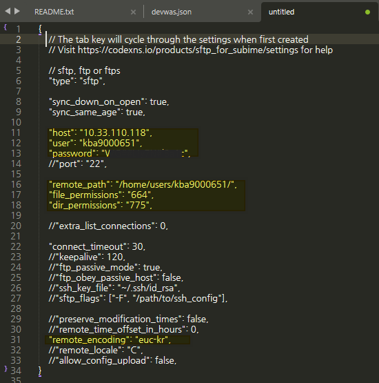
    - 저장하면 파일명을 물어보는데 경로를 바꾸지 말고 “devwas.json” 과 같이 hostname을 사용해 주거나 원하는 이름을 주면 된다. 단, `.json` 형식으로 저장해야 한다.
    - 저장 위치는 `C:\Users\사번\AppData\Roaming\Sublime Text\Packages\User\sftp_servers` 또는 `C:\Users\master\AppData\Roaming\Sublime Text\Packages\User\sftp_servers` 에 저장 된다. 
    - 이 위치는 plugin 설치경로 내의 `\User\sftp_servers` 위치이다.
    - 추후 삭제 또는 서버 정보 변경(비번변경 등) 시 직접 수정 하여 저장 할 수 있다.  

    ```
    [주의!] "remote_path" 지정 시 /home/www 와 같이 디렉토리 내 수 백개의 너무 많은 파일/디렉토리가 있는 경우 
            `SFTP: Browse Remote Server` 실행 시 화면 표시 문제로 탐색 창이 나오지 않는다. 
            /home/www/AsianPlatformWAS 와 같이 항목이 보다 적게 나오는 디렉토리로 지정해야 한다.
    ```

  2. 서버 접속 및 문서 열기  

    Command Palette `CTRL`+`SHIFT`+`P` > sbr 정도 입력 > `Browse Server...` 선택 
    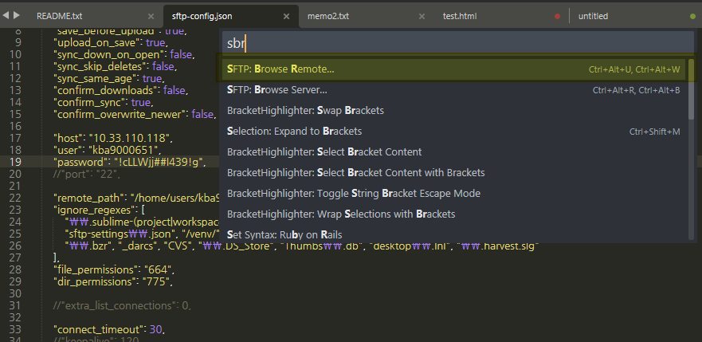

  3. 작업 할 서버 명을 선택   
    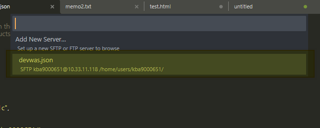  

  4. 파일 및 디렉토리 탐색  

    Home 디렉토리에 위치하게 되며, `Up a folder...`를 통해 직접 파일을 탐색 할 수 도 있고, 서버 IP가 나와 있는 제일 위 항목에 위치 후  Enter를 치면
    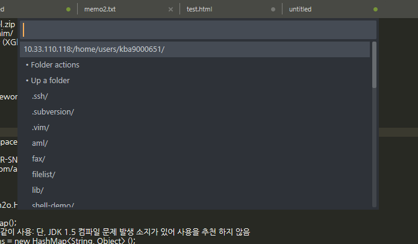

    다음과 같이 화면 아래에 표시되는 입력 창에서 Path를 직접 입력 할 수 있다.
    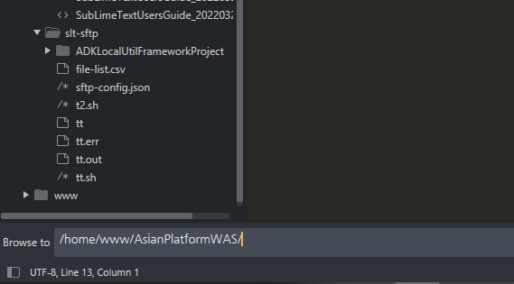
    ```
    [주의!] 디렉토리 내 수 백개의 너무 많은 항목이 있는 경우 표시 문제로 탐색 창이 나오지 않는다. 
            이 경우 하단 Path 입력 창이 나오게 하여 보다 적은 항목이 나오는 디렉토리로 변경 한다.
    ```

  5.  편집 할 파일이 나오면 파일을 선택 후 `Enter` > `Edit` 를 선택 한다.
    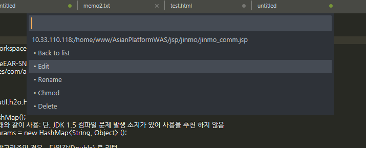  

  이제 수정하고 저장 하면 Remote 서버의 파일이 Local PC를 거치지 않고 바로 수정 된다. 이후 Editor를 종료 후 다시 열어도 Tab이 열려 있으면 바로 서버의 파일을 수정 할 수 있다.  
  단, 서버의 Password 가 변경된 경우 열린 Tab에서 Error 가 발생하고 수정이 불 가능 하므로 1번에서 등록 한 json 파일에 변경 비번을 적용해야 한다. 

<br>

#### 6.2 PC 폴더를 기준으로 작업 하기 
  1. Side Bar 에서 SFTP 사용을 원하는 디렉토리를 찾아 `우측클릭` > `SFTP/FTP` > `Map to Remote` 선택
  2. `sftp-config.json` 파일이 해당 폴더에 생기며 다음 항목을 주로 편집 하게 된다.

```json
{
    "save_before_upload": true,   // 업로드 전 저장 필수 여부
    "upload_on_save": true,    //저장 시 자동 업로드 여부
    
    "host": "10.33.110.118",   
    "user": "adk9000000",
    "password": "password",
    "port": "22",
    
    "remote_path": "/home/users/kba9000651",  //업로드 할 경로를 절대경로로 써 준다

    "file_permissions": "664",
    "dir_permissions": "775",
}
```

3. [Optional] 개발서버 인 경우 공동작업의 권한문제 방지를 위해 "file_permissions", "dir_permissions"를 예제와 같이 Setting 해 주는 것을 권장.
4. 빈 폴더에 서버의 파일 또는 디렉토리를 받을 때: `sftp-config.json`  파일이 열린 탭에서 > Command Palette (`CTRL`+`ALT`+`P`) > `SFTP: Browse Remote...` (sbr 입력) >  원하는 Directory 또는 파일을 찾아 `Enter` > `Folder Action`(폴더인 경우만) > `Download`

4. [Optional] "upload_on_save": false 일 시 Side Bar에서 우측 클릭 으로 수동 업로드를 할 수 있다. 자동인 경우 저장 즉시 Remote Path에 업로드 된다.
5. 좌측 Side Bar 에서 우측 클릭 후 `Download Folder`, `Upload Folder` 및 `Download File`, `Upload File` 을 이용하여 폴더와 서버의 항목들을 개별 적으로 일치시킬 수 있다. 
6. `Sync Remote -> Local` 또는 반대의 기능을 사용 하여 디렉토리 전체를 서버와 Sync 시킬 수 있다.

<br><br>

### 7. Plugin 관리


#### 7.1 플러그인 설치
플러그인 프로그램을 설치하기 위해서는 인터넷에 연결되어 있어야 하며 PackageControl 이 설치 되어 있어야 한다.   
> Command Palette (`CTRL`+`ALT`+`P`) > Install Package Control   

플러그인 설치 방법  
  >  Command Palette > `Package Control: Install Package`  (`pcip` 입력)
  >  원하는 패키지명을 입력하여 선택 > 최측 하단에 설치 Progress 및 상태가 표시됨  

인터넷 연결이 불가능 한 환경에서는 인터넷이 가능 한 PC에 Sublime Text를 설치하여 수동으로 복사 하여 옮겨준다.  
  > 1. Sublime Text를 종료
  > 2. `C:\Users\사용자명\AppData\Roaming\Sublime Text` 의 `Installed Packages` 와 `Packages` 폴더안에 추가된 플러그인 파일을 관리망 또는 업무망으로 복사
  > 3. Command Palette > `Preferences: Package Control Settings` (`ppc`) 실행
  > 4. "installed_packages" 항목에 추가된 패키지 명을 추가 - 패키지 명은 인터넷 연결 PC의 것을 확인

<br>

#### 7.2 설치된 플러그인 목록 보기  
어떤 플러그인이 설치 되어 있는지 목록을 보여 준다.  
> Command Palette (`CTRL`+`ALT`+`P`) > `Package Control: List Packages` (`pcli` 입력)

<br>

#### 7.3 플러그인 관리 - 삭제 및 Update

  >  삭제: Command Palette > `Package Control: Remove Package`   (`pcrp` 입력)   
  >  Update(인터넷 필요): Command Palette > `Package Control: Upgrade Package`  (`pcup` 입력)   

<br>

#### 7.4 사전 제공 플러그인 목록

| Plugin 명 | 설명 |
|----|------|
| Package Control | Plugin 설치, 관리 |
|CovertToUTF8 | EUC-KR Locale 지원 |
|BracketHighlighter | Bracket 표시 기능 확장 |
|SFTP | SFTP 업로드 및 Sync 기능 |
|Compare Side-By-Side | 2개파일 비교(diff) 기능 |
|HexViewer | Binary Data에 대한 편집, 조회 |
|Nodejs | Nodejs 개발용 |
|MarkdownPreview | Markdown 문서 작성 및 조회 |

