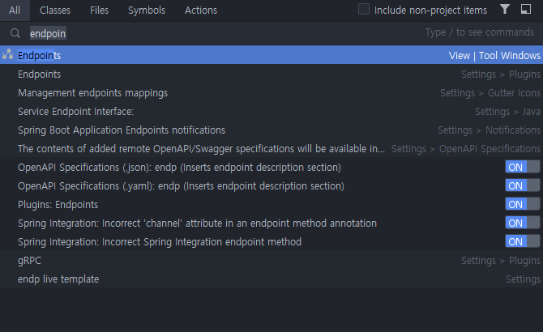

#### IntelliJ IDEA 를 이용한
폐쇄망에서 Spring Boot Project 시작 하기 
===================  
  
  >  `@author Tansan Man(tansan5150)`    
  >  `@up to date 2023.05.26` 
    
<br>

[](https://creativecommons.org/licenses/by/2.0/kr/)  
본 웹사이트는 크리에이티브 커먼즈 저작자표시 2.0 대한민국 라이선스에 따라 이용할 수 있습니다.  

<br>  

### 1. Spring Initilalizr
본 Guide는 인터넷이 열되지 않은 폐쇄망(내부망)에서 Spring Boot Project 를 생성하고 사용 하는 방법에 대한 안내서다.  
사용 도구는 IntelliJ IDEA 를 기준으로 설명한다. 하지만 STS(Eclipse)를 사용하여 Project를 생성하는 것도 크게 다르지 않다. 따라서 적절히 참고하여 적용 하면 된다.    

Spring Boot Project 는 IDE 에서 New Project 기능을 이용하여 쉽게 생성 할 수 있으나 아쉽게도 인터넷이 되지 않는 폐쇄망에서는 IDE 안에서 프로젝트를 생성 할 수 없다. 이것은 IntellJ IDEA, STS 등 툴과 상관없이 공통적인 사항이다.  

#### 1.1 폐쇄망 원격 Repository 확인
사내 Nexus 와 같은 원격 Repsitory 주소를 확인 한다.  
만약 Reository가 Proxy로 구성되어 있지 않으면 직접 Spring 관련된 라이브러리를 옮겨야 할 수 있다. 

1. 인터넷이 되는 PC에서 새 Spring Boot 프로젝트를 시작 한다.  
2. 아래 1.3절을 참조하여 필요한 버전 및 Maven을 선택 하고 Dependencies 의 모든 항목을 선택 한다.  
3. 아래 2장의 내용을 참고하여 Local Maven 저장소(.m2)의 위치를 새 위치로 설정한다. 
4. 프로젝트가 빌드되면 .m2 를 압축하여 폐쇄(냐부)망 으로 옮긴 후 Nexus에 업로드 해준다.
5. Nexus 적용시 디렉토리 구조 그대로 압축을 풀어서 적용 가능하며, Nexus Admin 으로 Rebuild Index 를 수행한다. 

#### 1.2 프로젝트 파일 만들기

1. 인터넷 망 > 웹브라우저 > https://start.spring.io  접속
2. 아래와 같은 화면이 나온다.

> Spring Initializr의 버전은 시간이 지남에 따라 변경된다.  
> 따라서 일단 유사한 버전을 선택해 받은 후 아래 1.3 절의 절차를 참고하여 pom.xml 에서 버전을 변경 해 준다. 

3. 항목 설정  
  - Project: Maven 
  - Spring Boot: RELEASE 버전 3가지만 지원, SNAPSHOT 버전 사용 불가.  
  - Java: Spring Boot 3.X 는 최소 17 이상, 2.7.X는 11 이상  
  - Project Meta Data: `Artifact` 는 보통 소문자로 쓰고 단어 연결에 - 를 사용한다. `Name` 은  Camel Case 표기법을 따르고 Project 명 또는 Application 명을 기술 한다.  
  - Dependencies: 대부분 사용 가능, 단 학습이나 테스트 목적이면 위 예저 처럼 기본적인 항목 선택 권장  
4. `GENERATE` 버튼을 눌러 `artifact명.zip` 파일을 다운로드     
5. 귀찮으면 아래 Sample 을 사용해도 된다.  
위 사진과 동일 한 내용의 프로젝트 설정 파일이다.  
[Spring Demo Project](./resources/demo1.zip)

#### 1.3 프로젝트 파일 이동
편의상 C:\idea\ideaProjects 에 Project가 위치한다고 가정한다. STS 사용자는 해당 workspace 위치에 동일 작업을 하면 된다.  

1. 망간 자료전송 프로그램을 통해 인터넷 > 업무망 > 관리망 순으로 zip 파일을 이동한다.  
2. 이동 후에는 각 IDE의 Project (또는 workspace) 위치에 해당 파일을 위치 시키고 압축을 푼다.  
 
3. 압축해제 후 디렉토리 명을 원하는 Project 명으로 변경한다.  

지금 만들어진 폴더는 아직 IntellJ 나 Eclipse 중 어떤 형식의 Project 도 아니다. 따라서 이제 IDE에 해당 디렉토리를 Import 하여 프로젝트로 만들어줘야 한다. 

#### 1.4 Spring Boot 버전 선택 - pom.xml 수정
Spring Initializr의 Version은 시간에 따라 변경 되므로 실제 폐쇄(내부)망에서 미리 받아놓은 사용 가능한 버전으로 변경 할 필요가 있다.

* 예: 폐쇄(내부)망 사용 가능 버전

|SpringBoot 버전|JDK 최소 버전|
|:-----:|:--:|
|3.1.1|17 |  
|3.0.8|17 |
|2.7.13|11 |  

아래와 같이 Project Root의 pom.xml 파일을 변경한다. 

```xml
<parent>
    <groupId>org.springframework.boot</groupId>
    <artifactId>spring-boot-starter-parent</artifactId>
    <version>3.1.1</version>
    <relativePath/> <!-- lookup parent from repository -->
</parent>
```


<br>

### 2. Project 만들기
#### 2.1 Maven 설치
폐쇄망(내부망)의 Nexus와 같은 원격 Repository가 https가 아닌 http로 되어 있으면 Maven은 3.6.3 이하 버전만 사용 가능하다. 그 상위 버전 부터 https 만 지원하고 http는 지원하지 않는다. 특히 폐쇄망의 특성상 http인 경우도 많으니 사내 구축된 저장소를 반드시 확인 해야 한다.  

1. Apache Maven 다운로드  
[Apache Maven 최신버전](https://maven.apache.org/download.cgi)
[Apache Maven 3.6.3](./resources/apache-maven-3.6.3.zip)
2. 원하는 곳에 압축 해제  
예: `C:\idea\apps\apache-maven-3.6.3`
3. `settings.xml` 수정  
`C:\idea\apps\apache-maven-3.6.3\conf\settings.xml` 의 내용 중 maven local 저장소 위치를 원하는 위치로 변경 한다.  
default 위치인 `C:\Users\<user_id>\.m2` 와 같은 곳을 사용 하고자 한다면 해당 설정을 삭제 한다.  
```xml
<localRepository>C:/idea/m2/repository/</localRepository>
```
> ※ 폐쇄(내부)망 Nexus 예: http://nexus.helloworld.co.kr:8110/content/groups/li-claim/
#### 2.2 프로젝트 Import  
1. IntelliJ IDEA 실행   
`File` > `New` > `Project from Exisiting Sources`
2. 앞에서 만든 디렉토리 선택 (`예: SpringBootDemo1`)
3. Import project 팝업  
`Import project from external model` > `maven` > `create`
 

#### 2.3 Maven 설정
아직은 뭐가 잘 안 된다. 기다려 봐야 Timeout Message 정도만 나온다. 이제 IDE 에서 Maven 설정 한 후 Reload 해 줘야 한다.  

1. Server Certificates 설정  
`Settings` > `Tools` > `Server Certificates` > `Accept non-trusted certificates automatically` 에 체크 
2. Maven 설정  
`Settings` > `Build, Execution, Deployment` > `Maven` 

  - Maven home path: 위에서 설치한 3.6.3 버전의 maven 위치를 지정  
  - User settings file: Override 에 체크 후 conf 에 있는 settings.xml 을 지정  
  - Local Repository: settings.xml 설정에 따라 자동으로 지정 된다.  
설정 후 이런 모습이 된다. 
 

3. Project Reload  
우측 화면에서 `pom.xml` 을 우측클릭 > Maven > `Reload Project` 실행   
 

이제 우측 화면에서 `External Libraries` 를 확인 하면 많은 라이브러리 들이 들어와 있는 것을 확인 할 수 있다. 
이로서 모든 설정은 완료되고 개발 할 준비가 끝났다.   


<br>

### 3. 예제 코드
#### 3.1 Hello World  
이제 진짜 잘 돌아가나 월드 룰인 Hello World 를 만들어 확인해 보자. 간단한 REST 인터페이스를 구현해 본다.   

1. Package 생성  
`src > main > java` 안에 `com.helloworld.demo1` 패키지에 controller 패키지를 추가한다.
2. Class 생성   
위 패키지에 Demo1Controller 클래스를 생성 한다.  
```java
@RestController
public class Demo1Controller {

    @GetMapping("/hello/{variable}")
    public String getHello(
            @PathVariable("variable") String var1,
            @RequestParam String name) {
        return "Hello World! "+var1+" "+name;
    }

    @PostMapping("/hello2/{variable}")
    public String getHelloPost(@PathVariable("variable") String var1) {
        return "Hello POST World! "+var1;
    }

}
```

3. Build 및 실행  
우측 Project 화면에서 `SpringBootDemo1Application` 우측클릭 > `Run 'SpringBootDemo1Appli..'` 를 실행 한다.  
아래와 같이 tomcat 이 실행 된다.  
  
  - 시작: 최초 실행 후 앞으로 `SHIFT`+`F10` 으로 간단하게 실행 가능   
  - 중지: `Run` 화면에서 Stop 버튼 또는 `CTRL`+`F2` 단축키를 이용  
>  ※ 최초 실행 시 JDK 하위버전 옵션 사용 문제로 아래와 같은 Warning 이 발생한다.  
> *OpenJDK 64-Bit Server VM warning: Options -Xverify:none and -noverify were deprecated in JDK 13 and will likely be removed in a future release.*  
> 해결방법: `Run` > `Edit Configurations..` > `Modify Options` > `Disable Launch Optimization`  체크

<br>

#### 3.2 어플리케이션 테스트   
보통은 Postman 같은 API Client 툴에서 테스트를 한다. GET Method 의 경우 그냥 브라우저에서 해도 된다. 하지만 IntelliJ IDEA 에 내장된 편리한 툴이 있으므로 편리하게 사용 할 수 있다. 단지 테스트 용도 뿐만 아니라 코드의 API를 파악하고 관리하는데 매우 유용한 도구이다.  

1. API 테스트 도구  
`SHIFT` 키를 두 번 눌러 'endpoint' 라고 검색 하자. 아래와 같이 나오면 선택 한다.      
 

2. GET API 테스트  
`Endpoints` 화면이 나오면 테스트 할 API를 선택 하고 `HTTP Client` 탭을 클릭한다.  
Variable 하나와 QueryString 하나가 있으므로 아래와 같이 적당히 넣어준 후 `Submit Request`  를 클릭 한다.  
```
GET http://localhost:8080/hello/demo1?name=JoaPing
```
   

3. POST API 테스트  
Variable 하나만 있는 POST Method는 아래와 같이 테스트 한다. 
```
POST http://localhost:8080/hello2/HachuPing 
```
 


<!--
1. Plugin Update 시 인증서 오류 해결

1.1 IntelliJ 실행 JDK

cacerts 백업
cd "C:\Program Files\JetBrains\IntelliJ IDEA 2022.1.4\jbr\lib\security"
..\..\bin\keytool -keystore .\cacerts -importcert -alias helloworld -file .\_wildcard_helloworld_co_kr.crt
 (password : changeit)

1.2 Compile 용 JDK 

cacerts 백업
 cd D:\idea\java\jdk11.0.15_9\lib\security
..\..\bin\keytool -keystore .\cacerts -importcert -alias helloworld -file .\_wildcard_helloworld_co_kr.crt
 (password : changeit)


D:\idea\java\jdk1.8.0_202\jre\lib\security

./gradlew build

1.3 설정 변경
Tools > Server Certification > Accept non-trusted certificates automatically

-->