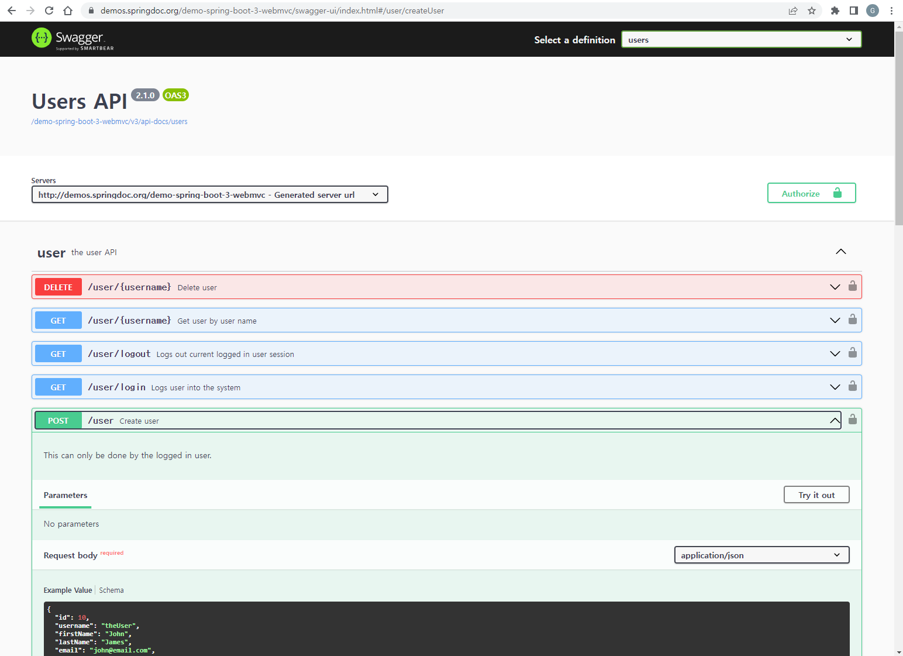
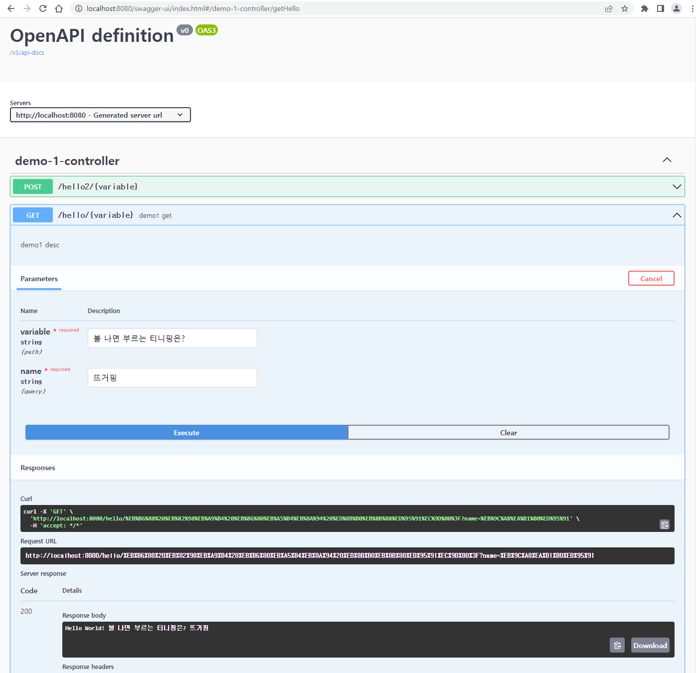

Spring Boot Swagger 적용 Guide
===================  
  
  >  `@author Tansan Man(tansan5150)`    
  >  `@up to date 2023.06.30` 
    
<br>

[](https://creativecommons.org/licenses/by/2.0/kr/)  
본 웹사이트는 크리에이티브 커먼즈 저작자표시 2.0 대한민국 라이선스에 따라 이용할 수 있습니다.  

<br>

### 1. Swagger 개요
본 Guide는 Spring Boot  어플리케이션에서 Swagger 를 적용하고 사용 하는 방법에 대한 안내서다.  

#### 1.1 Swegger 사용 목적  
어플리케이션에 대한 문서 산출물은 관리적인 관점에서 보면 많은 문제점을 가지고 있다. 일단 실제 프로그램을 개발하는 것 이상의 많은 시간을 필요로 하고 사람마다 작성 수준이 틀려 일정한 품질을 유지하기도 힘들다. 뿐만아니라 현재 최신 코드의 변경 사항이 제대로 적용 되어 있는지 보장하기도 어렵다.  

특히 MSA(Micro System Architecture) 환경에서 API의 명세는 그 양도 많아지고 정확성이 매우 중요하므로 API를 Excel로 된 문서 산출물 통해 관리하는 방식은 매우 비효율 적일 뿐만 아니라 어플리케이션의 품질에도 심각한 영향을 미칠 수 있다.

따라서 이런 문제점을 해결하기 위해 Swegger를 사용한다.  

- 코드와 통합되어 별도의 문서를 만들지 않아도 된다.  
- 항상 현재 시점의 Application의 명세를 공유 한다.   
- 실제 Data를 넣어 응답 및 API의 동작을 확인 할 수 있다.   

각 서브시스템 별로 Swagger UI 라 부르는 아래와 같은 화면을 통해 API 명세를 실시간으로 확인 하고 테스트 할 수 있다.    

- Swager UI 샘플  
  
<br>

#### 1.2 Swagger 구현 도구
Springdoc(org.springdoc) 도구를 사용하여 Swagger를 구현한다. Swagger의 구현 대상은 OpenAPI 3.0 명세를 대상으로 한다.     

과거에는 Springfox(io.springfox) 도구를 사용하여 Swagger를 구현하는 경우가 많았다. 특히 개인 Blog 나 2~3년 전 집필된 Spring Boot 서적을 보면 대부분 Springfox 를 사용하여 Swagger를 구현하고 있다. 하지만 Springfox Project는 2020년 이후 더 이상 개발되지 않고 멈춰 있으며, 현재의 Spring Boot 3.X 또는 2.7 기반 프로젝트에서 더 이상 사용 할 수 없다.  

따라서 현 시점에는 Springdoc 을 통해 Swagger를 구현해야 한다.   
<br>

### 2. Maven 및 pom 설정
다음 문서의 Demo 프로젝트를 기준으로 Swagger 적용을 설명 한다. 그리고 AXA 사내 관리망 사용을 전제로 한다.    
> https://devlap.axa.co.kr/devdocs/spring-init  

※ IntelliJ IDEA 를 기준으로 설명하지만 다른 STS나 다른 IDE 사용 시 명칭만 약간 다르고 대부분 거의 유사하다.   
<br>

#### 2.1 maven 설정
Maven 및 Nexus 저장소 설정이 사전에 되어 있어야 한다.   
만약 설정 되지 않았으면 아래 내용을 참고하여 maven 및 nexus 를 설정 한다.  
> [Maven 설정](https://devlap.axa.co.kr/devdocs/spring-init/#21-maven)  

※ 관리망 Nexus : http://nexus.axa.co.kr:8110/content/groups/axadev/

<br>

#### 2.2 pom.xml 의존성 추가
프로젝트의  pom 파일에 아래 내용을 추가한다.  

1. Spring Boot 3.X
```xml
<dependency>
    <groupId>org.springdoc</groupId>
    <artifactId>springdoc-openapi-starter-webmvc-ui</artifactId>
    <version>2.1.0</version>
</dependency>
```
2. Spring Boot 2.7.X
```xml
<dependency>
    <groupId>org.springdoc</groupId>
    <artifactId>springdoc-openapi-ui</artifactId>
    <version>1.7.0</version>
</dependency>
```

※ 본 문서는 Spring Boot 3.1.X, 3.0.X, 2.7.X 버전을 기준으로 테스트 하고 작성 하였다. 현 시점의  Snapshot 버전인 3.2 또는 과거 버전에 대해서는 기술된 내용과 다를 수 있다.  
<br>

#### 2.3 Swagger UI 확인
1. 실제 Swagger UI를 화면에 띄워 확인해보자.    
 > 1.  `pom.xml` 우측클릭 > `Maven` > `Reload Project`  실행
 > 2. `Run` > `Run SpringBootDemo1Application`     

2. Browser 에서 아래 주소 중 맘에 드는 것으로 하나 골라 실행 한다.  
*※ 설마 IE에서 시도하는 흑우는 없을거라 믿는다.*   
> http://localhost:8080/swagger-ui.html  
> http://localhost:8080/swagger-ui/index.html  

3. 실제 Data 를 넣고 Request 를 날려 Response 를 확인 해 보자.  


<br>

### 3. Swagger Configuration

프로젝트 내 config Package를 하나 만들고 그 안에 SwaggerConfig Class를 하나 만든다.  

```java
@Configuration
@EnableWebMvc
public class SwaggerConfig {
    @Bean
    public OpenAPI openApi() {
        return new OpenAPI()
                .info(new Info().title("Test API")
                        .description("Test api 입니다.")
                        .version("1.0.1")
                );
    }
}
```


<br>

### 4. 각 API 별 Swagger 명세

